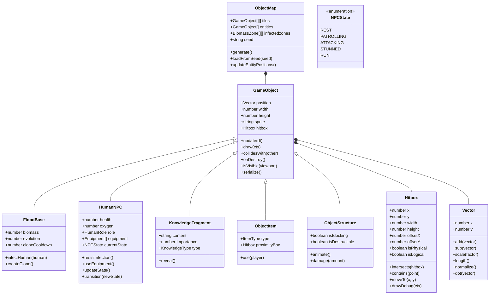

# **Cosmonavt: The Flood Edition** _Documento de Diseño de Juego_

### **Cosmonavt © MAAN STUDIOS Todos los derechos reservados.**
**Por Mariano Carretero, Isabela Valls, Hans Preinfalk**

## _Index_

1. [Game Design](#game-design)
    1. [Summary](#summary)
        1. [Story](#story)
    2. [Gameplay](#gameplay)
    3. [Mindset](#mindset)
2. [Technical](#technical)
    1. [Screens](#screens)
    2. [Controls](#controls)
    3. [Mechanics](#mechanics)
3. [Level Design](#level-design)
    1. [Themes](#themes)
    2. [Game Flow](#game-flow)
4. [Development](#development)
    1. [Abstract Classes](#abstract-classes--components)
    2. [Derived Classes](#derived-classes--component-compositions)
5. [Graphics](#graphics)
    1. [Style Attributes](#style-attributes)
    2. [Graphics Needed](#graphics-needed)
6. [Sounds / Music](#sounds--music)
    1. [Style Attributes](#style-attributes-1)
    2. [Sounds Needed](#sounds-needed)
    3. [Music Needed](#music-needed)
7. [Schedule](#schedule)

## _Game Design_

---

### **Summary**

Cosmonavt: The Flood Edition es un roguelite de acción sci-fi con perspectiva top-down. Como una entidad Flood inteligente, tu objetivo es encontrar y destruir la cura antes de que los humanos puedan desarrollarla. Explorarás estaciones espaciales abandonadas y naves, absorbiendo el conocimiento de los humanos eliminados para expandir tus capacidades y descubrir pistas sobre la ubicación de la cura. Esta versión se centra exclusivamente en la experiencia Flood, con soporte multijugador para juego cooperativo solo entre jugadores Flood.

#### Story

Una entidad alienígena (el Flood) evolucionó en el vacío del espacio tras ser expuesta a la radiación de un agujero negro. Esta forma de vida logró infiltrarse en una estación espacial humana, iniciando una infestación que se propagó rápidamente.

Como un Flood primario, has absorbido el conocimiento de un científico de alto rango y has desarrollado inteligencia superior y autoconciencia. A diferencia de otros Flood, comprendes que los humanos supervivientes están trabajando en una cura que podría erradicar a toda tu especie. Tu misión es clara: encontrar la cura antes que ellos y destruirla.

La información sobre la cura está dispersa entre diferentes científicos y ubicaciones. Cada humano que asimilas te proporciona parte de sus conocimientos, acercándote a tu objetivo. Debes navegar a través de entornos generados proceduralmente, evolucionando tus capacidades y duplicándote para aumentar tus posibilidades de éxito.

### **Gameplay**

Como el Flood, exploras entornos mientras buscas humanos para absorber su conocimiento y obtener biomasa. Cada humano eliminado te proporciona biomasa para evolucionar y, si es un científico o personal importante, información vital sobre la cura. El mundo se genera proceduralmente, creando una experiencia única en cada partida.

El objetivo principal es encontrar los tres fragmentos de información necesarios para localizar la cura antes de que los humanos la desarrollen. Debes gestionar tu biomasa para desarrollar mejoras que te permitan acceder a nuevas áreas y superar las defensas humanas. La mecánica de clonación te permite crear nuevos Flood para expandir tu presencia, aunque cada clon requiere biomasa y tiene su propio cooldown.

El multijugador te permite formar equipo con otros jugadores Flood para el juego cooperativo, enfrentándose juntos a los NPC humanos y sus defensas.

### **Mindset**

Buscamos crear una experiencia de caza estratégica donde los jugadores Flood deben adaptarse constantemente para sobrevivir y cumplir su misión. La sensación debe ser de poder creciente con cada infección exitosa, con el desafío de tomar decisiones tácticas sobre cuándo atacar, cuándo clonarse y qué mejoras priorizar.

Queremos que los jugadores desarrollen estrategias de emboscada, infiltración y asalto directo, creando una experiencia de juego que alterne entre el sigilo calculado y los momentos de poder desatado. El jugador debe experimentar la satisfacción de absorber conocimiento y aumentar su biomasa, sintiendo cómo cada éxito lo acerca más a su objetivo.

## _Technical_

---

### **Screens**

- Menú Principal
    - Opciones
        - Volumen (general, música, efectos)
        - Idioma
        - Brillo
        - Controles
    - Crear Partida
        - Seleccionar dificultad
        - Pública/Privada
            - Copiar código de invitación
            - Enviar código de invitación
        - Semilla de mundo personalizada
    - Unirse a Partida
        - Partidas públicas
        - Partidas privadas (código)
- Juego
    - HUD
        - Nivel de biomasa
        - Nivel de evolución
        - Tipo de habilidad
        - Número de clones
        - Salud
        - Fragmentos encontrados
        - Cooldown de habilidades
    - Conocimiento Absorbido
        - Fragmentos de información sobre la cura
        - Pistas de ubicación para próximos objetivos
    - Menú de pausa
        - Salir / guardar / reiniciar
        - Revisar objetivos actuales
        - Opciones multijugador
- Pantalla de Resultados
    - Tiempo de partida
    - Muertes
    - Asesinatos (Humanos/Floods)
    - Tamaño del ejército
    - Distancia recorrida
    - Fragmentos descubiertos vs. total

### **Controls**

- Movimiento: WASD / Teclas de flecha
- Atacar: Click izquierdo (dirigido con el ratón)
- Agarrar/Interactuar: E
- Habilidad especial (Clonación): Q
- Cambiar ataque: R
- Sprint: Shift
- Comunicación: C (chat de texto)
- Menú de Pausa: Espacio

### **Mechanics**

#### Sistema de Combate

El Flood puede llevar hasta 2 tipos de ataque activos al mismo tiempo, alternados con la tecla R y ejecutados con el botón izquierdo del ratón. Los ataques se dirigen hacia el cursor del ratón. Esta limitación obliga a tomar decisiones estratégicas según la situación de combate.

Tipos de ataque Flood:
- Golpe cuerpo a cuerpo: 10 de daño a corta distancia
- Vómito ácido: 5 de daño + visión distorsionada por 2s
- Humo tóxico: ralentiza a los humanos un 30%, duración 5s
- Lanzamiento de espinas: 20 de daño a distancia, cooldown de 4s

Efectos de ataque:
- El ácido deja efectos de estado persistentes
- El humo reduce movilidad
- No hay fuego amigo entre jugadores Flood

#### Sistema de IA para NPCs

Los NPCs son controlados por un autómata complejo que responde a diversos inputs que provocan cambios de estado. Cada NPC puede estar en uno de los siguientes estados:

- **Rest**: Estado de descanso, salud completa, permanece en un punto.
- **Patrolling**: Patrullando el mapa, moviéndose entre puntos predefinidos.
- **Attacking**: Persiguiendo y atacando al jugador.
- **Stunned**: Aturdido temporalmente (3 segundos), no puede moverse.
- **Run**: Huyendo del jugador, su salud se regenera lentamente (1% por segundo).

Los inputs que provocan transiciones entre estados son:
1. Recibir daño → Transición según tabla
2. Colisión con Jugador → Transición según tabla
3. Detectar Jugador → Transición según tabla
4. Vida IA < 10 → Generalmente cambia a estado Run
5. Recibir daño > 55 → Generalmente cambia a estado Stunned
6. Jugador Cerquita (Zona de peligro) → Transición según tabla
7. Vida IA > 50 → Transición según tabla
8. Matar jugador → Transición según tabla

La tabla de transiciones determina el nuevo estado según el estado actual y el input recibido. Por ejemplo, si un NPC está en estado Rest y recibe el input 3 (Detectar Jugador), cambiará a estado Attacking.

#### Absorción y Clonación

**Sistema de Infección**  
El Flood puede infectar humanos a través de ataques cuerpo a cuerpo o a distancia. Al eliminar a un humano, obtienes biomasa que puedes utilizar para curarte, clonarte o evolucionar.

**Clonación con Cooldown**  
Al activar la habilidad especial (Q), consumes 1 biomasa y después de 5 segundos generas un clon con 50% de salud. Este proceso requiere estar quieto y si es interrumpido, debe reiniciarse. La clonación tiene su propio cooldown.

**Absorción de Conocimiento**  
Al infectar humanos, especialmente científicos, obtienes fragmentos de información sobre la cura. La calidad y cantidad de información varía según el rol del humano, siendo los científicos los más valiosos para tu objetivo.

**Biomasa como Recurso Principal**  
La biomasa obtenida de humanos y recursos orgánicos es la moneda para desbloquear mejoras. Los valores de biomasa varían por tipo:
- Civil/cientifico: 1 biomasa
- Militar: 2 biomasa

La biomasa puede usarse para:
- Curarse (+15 HP por unidad)
- Crear clones (1 biomasa por clon)
- Evolucionar (requiere 3 cadáveres humanos)

#### Mejoras y Evolución

La evolución del Flood se activa después de consumir 3 cadáveres humanos, subiendo de nivel y otorgando mejoras permanentes. Las evoluciones son simples pero efectivas, aumentando tus capacidades ofensivas, defensivas o de sigilo dependiendo de tu estilo de juego.

Conforme evolucionas, tu apariencia física cambia, volviéndote más grande y con nuevas características visuales que reflejan tu poder creciente.

#### Sentidos Mejorados y Visión

**Percepción Flood**  
El Flood tiene mejor visión distinta a la de un humano, es más oscura y grotesca.

La visión del Flood se ve afectada por estructuras grandes y obstáculos sólidos.

#### Resistencia y Habilidades Especiales

**Sprint**  
El Flood puede esprintar (tecla Shift) durante 4 segundos con un cooldown de 8 segundos.

**Clonación (habilidad Q)**  
Requiere estar quieto, consume 1 biomasa, tarda 5 segundos y genera un clon con 50% de HP. Si se interrumpe, el proceso se reinicia.

## _Level Design_

### **Themes**

#### 1. Estación Espacial Contaminada

**Ambiente:**  
Pasillos metálicos parcialmente cubiertos de biomasa orgánica, luces fallando, áreas selladas por crecimiento Flood.

**Narrativa:**  
Tu primera zona de expansión. El objetivo es infectar áreas críticas y encontrar el primer fragmento de conocimiento sobre la cura.

**Jugabilidad:**
- Perfecto para aprender mecánicas básicas de infección.
- Múltiples rutas para flanquear posiciones defendidas.
- Científicos con los primeros fragmentos clave sobre la cura.
- Áreas con condiciones de luz variables que afectan tu percepción.

#### 2. Nave de Evacuación

**Ambiente:**  
Espacios confinados, sistemas de descontaminación activos, humanos armados en constante movimiento.

**Narrativa:**  
Humanos intentando escapar con información crítica. Tu objetivo es interceptarlos y absorber sus conocimientos.

**Jugabilidad:**
- Entorno dinámico con sistemas de purga que los humanos pueden activar.
- Rutas de escape que necesitarás bloquear.
- Objetivo de sabotaje: impedir que la nave sea reparada y pueda despegar.

#### 3. Estación de Investigación Orbital

**Ambiente:**  
Módulos científicos de alta tecnología, áreas de cuarentena, sistemas de seguridad avanzados.

**Narrativa:**  
Un centro de investigación donde se estudian muestras del Flood y se desarrollan posibles componentes para la cura.

**Jugabilidad:**
- Sistemas de seguridad complejos que debes desactivar.
- Áreas de contención que limitan temporalmente tus habilidades.
- Científicos de alto nivel con información valiosa para tu misión.
- Retos basados en infiltración más que en combate directo.

#### 4. Laboratorio Central

**Ambiente:**  
Instalación high-tech, sistemas de contención biológica, iluminación brillante que dificulta el sigilo, defensas avanzadas.

**Narrativa:**  
El centro de investigación donde los humanos desarrollan la cura. Tu objetivo final es encontrar el prototipo y destruirlo.

**Jugabilidad:**
- Zona de máxima seguridad con trampas y defensas.
- Científicos protegidos por escoltas de soldados NPCs.
- Confrontación final que requiere destruir componentes específicos.

### **Game Flow**

1. **Despertar como Flood inteligente**  
   Emerges con conciencia tras absorber a un científico, descubriendo tu misión de encontrar la cura.

2. **Tutorial básico**  
   Aprendes a moverte, atacar y absorber humanos.

3. **Primer fragmento de conocimiento**  
   Al eliminar a un científico, obtienes el primer fragmento de información sobre la cura.

4. **Expansión inicial**  
   Comienzas a explorar la estación espacial, acumulando biomasa y evolucionando capacidades básicas.

5. **Descubrir nuevas áreas**  
   Los fragmentos de conocimiento revelan la ubicación de nuevas zonas donde buscar más información.

6. **Dominar la clonación**  
   Aprendes a usar la biomasa para crear clones y expandir tu presencia.

7. **Evolución**  
   Tu Flood crece y se fortalece, desarrollando nuevas capacidades ofensivas.

8. **Carrera por los componentes**  
   Compites con humanos NPCs para encontrar componentes físicos de la cura.

9. **Confrontación con especialistas humanos**  
   NPCs con roles específicos (soldados con armas anti-Flood, ingenieros con trampas) presentan desafíos únicos.

10. **Sabotaje estratégico**  
    Interrumpes los esfuerzos humanos dañando equipamiento o bloqueando rutas clave.

11. **Descubrimiento del laboratorio central**  
    Localizas el centro donde los científicos humanos están completando la cura.

12. **Confrontación final**  
    Te enfrentas a los últimos defensores humanos protegiendo el prototipo de la cura.

13. **Victoria o derrota**  
    Si destruyes la cura, garantizas la supervivencia de los Flood. Si los humanos la completan, tu especie está condenada.

## _Development_

El sistema de clases en *Cosmonavt: The Flood Edition* utiliza una arquitectura basada en componentes según lo especificado en los requisitos técnicos. Las clases base y sus relaciones se definen a continuación.

### **Abstract Classes / Components**

## _Graphics_

### **Style Attributes**

#### Estilo Visual General

*Cosmonavt: The Flood Edition* utiliza **pixel art de resolución media** con énfasis en la naturaleza orgánica y cambiante del Flood. Las unidades Flood son asimétricas, con animaciones que transmiten su naturaleza alienígena. El enfoque visual sigue siendo **semi-realista dentro de los límites del pixel art**, con énfasis en los efectos de corrupción ambiental.

#### Paleta de Colores

- **Tonos dominantes para el Flood:** verdes tóxicos, rojos orgánicos, púrpuras viscosos.
- **Biomasa:** texturas pulsantes con variaciones sutiles de color.
- **Contraste con humanos:** los humanos usan colores más metálicos y limpios, con variaciones según su rol (científicos, soldados, ingenieros).

#### Interfaces

- **HUD simple:** indicadores claros de biomasa, salud y habilidades.
- **Visión del Flood:** ligeramente diferente en zonas oscuras vs. iluminadas.
- **Pantalla de clonación:** interfaz básica que muestra el progreso de creación de clones.

#### Feedback Visual

- **Infección exitosa:** partículas orgánicas, transformación del sprite humano.
- **Clonación:** animación simple de división.
- **Evolución:** cambios visuales en el sprite del Flood, haciéndolo más grande y amenazante.
- **Detección de humanos:** indicadores visuales sutiles de presencia humana cercana.

### **Graphics Needed (Pixel Art)**

#### Personajes

- **Flood:** varias etapas de evolución, con sprites para movimiento, ataque, infección.
- **Humanos (NPCs):** científicos, soldados, ingenieros, cada uno con animaciones básicas.
- **Evoluciones visibles:** cambios de tamaño y forma en el sprite del Flood.

#### Entornos

- **Biomasa:** tiles que muestran diferentes niveles de contaminación Flood.
- **Sistemas de purificación:** dispositivos que los humanos pueden activar.
- **Zonas de investigación:** laboratorios y equipos científicos.
- **Trampas y defensas:** obstáculos típicos en escenarios.

#### HUD

- Indicadores de salud, biomasa y cooldowns.
- Fragmentos de conocimiento recolectados.
- Contador de clones creados.

#### Objetos

- Mejoras: representaciones visuales de las capacidades que puedes desarrollar.
- Fragmentos de conocimiento: dispositivos de datos o notas conteniendo información.
- Equipamiento humano anti-Flood: armas, trampas y herramientas.
- Componentes de la cura: objetos físicos que debes encontrar y destruir.

## _Sounds / Music_

### **Style Attributes**

#### Música

- Música **orgánica y perturbadora**, con elementos húmedos y pulsantes.
- Combinación de **texturas biomecánicas** con **disonancias crecientes**.
- Transiciones musicales según el nivel de tensión y combate.

#### Sonido

- Efectos orgánicos: viscosos, chirriantes, pulsantes.
- Contraste entre sonidos biológicos del Flood y tecnológicos de los humanos.
- Indicadores sonoros para detectar actividad humana cercana.

### **Sounds Needed**

#### Acciones del Flood

- Movimiento: sonidos húmedos, arrastre orgánico
- Infección: burbujeante, transformación dolorosa
- Clonación: sonido viscoso de división
- Evolución: metamorfosis orgánica, crujidos
- Ataques: ácido, golpes, espinas

#### Humanos y Entorno

- Acciones de humanos NPCs: pasos, comunicaciones, manipulación de equipos
- Equipamiento anti-Flood: fuego, purificación
- Sistemas de alerta: alarmas, cierres de emergencia
- Hallazgos de conocimiento: sonido distintivo de descubrimiento
- Trampas activándose: sonidos según el tipo

### **Music Needed**

| Situación             | Estilo musical sugerido                                    |
|-----------------------|------------------------------------------------------------|
| Exploración           | Pulsos lentos, tensión creciente, notas graves             |
| Caza activa           | Ritmos acelerados, capas sónicas superpuestas              |
| Confrontación         | Texturas disonantes, percusión intensa                     |
| Descubrimiento        | Revelación sonora, curiosidad alienígena                   |
| Evolución             | Transiciones tonales, transformación sonora                |
| Victoria Flood        | Triunfo perturbador, satisfacción alienígena               |
| Derrota Flood         | Desintegración sonora, final amargo                        |
| Tema principal        | Synth ambiental, notas lentas, arpegios en menor           |
| Nave infectada        | Pads disonantes, samples orgánicos, ritmo débil            |
| Espacio abierto       | Silencio con ecos, loops ambientales con distorsión        |
| Combate               | Chiptune agresivo + percusión digital, loops tensos        |
| Créditos finales      | Piano digital, sintetizador melancólico                    |

## _Schedule_

### Semana 1
- Requerimientos del juego
- Historias de usuario
- Feature request
- Nuevo GDD
- Contratos de endpoints
- Estructura del proyecto

### Semana 2
- Objeto Juego (Mariano)
- Objeto mapa (Angel)
- Objeto jugador (Emiliano)
- Objeto ítem (Katia)
- Objeto estructura
- Historia (Todos)

### Semana 3
- Generación de mapa
- Sockets (socket.io)
- Sprites completos (Textura de objetos)
- Tiles (Textura del mapa)

### Semana 4
- Pantalla de inicio
- Logger

### Semana 5
- Base de datos

### Semana 6
- Generación de niveles

### Semana 7
- Implementación de NPCs

### Semana 8
- Integración final y pruebas