# **Cosmonavt** _Game Design Document_

### **Cosmonavt © MAAN STUDIOS Todos los derechos reservados.**
**By Angel Montemayor Davila A01785840, Mariano Carretero Fuentes A01029708**

## _Index_

1. [Game Design](#game-design)
    1. [Summary](#summary)
        1. [Story](#story)
    2. [Gameplay](#gameplay)
    3. [Mindset](#mindset)
2. [Technical](#technical)
    1. [Screens](#screens)
    2. [Controls](#controls)
    3. [Mechanics](#mechanics)
3. [Level Design](#level-design)
    1. [Themes](#themes)
    2. [Game Flow](#game-flow)
4. [Development](#development)
    1. [Abstract Classes](#abstract-classes--components)
    2. [Derived Classes](#derived-classes--component-compositions)
5. [Graphics](#graphics)
    1. [Style Attributes](#style-attributes)
    2. [Graphics Needed](#graphics-needed)
6. [Sounds / Music](#sounds--music)
    1. [Style Attributes](#style-attributes-1)
    2. [Sounds Needed](#sounds-needed)
    3. [Music Needed](#music-needed)
7. [Schedule](#schedule)
8. [User Stories](#user-stories)
9. [Requirements](#requirements)
    1. [Functional](#functional-requirements)
    2. [Non-Functional](#non-functional-requirements)
10. [Feature Requests](#feature-requests)

## _Game Design_

---

### **Summary**

Cosmonavt es un roguelite sci-fi de acción con perspectiva top down. Explora el espacio tras un accidente temporal,
sobrevive a los Flood y reconstruye la historia perdida mientras cooperas o compites con otros jugadores.

#### Story

Una nave espacial en misión se ve atrapada en las cercanías de un agujero negro. La intensa distorsión del tiempo y el
espacio la divide en dos. El protagonista sobrevive y logra salir, pero lo que para él fueron solo minutos, para el
resto del universo fueron décadas. Al regresar a la estación espacial, la encuentra irreconocible: vacía, oscura, en
ruinas.
Al explorar, descubre señales de lucha, mensajes fragmentados y cuerpos en descomposición. En un cuarto, se encuentra
con el Flood, una entidad que inicialmente parece hostil. Apenas sobrevive al encuentro. Poco a poco, comienza a
reconstruir los eventos ocurridos durante su ausencia. La humanidad ha sido devastada por un virus desconocido que se ha
esparcido por estaciones y planetas.
La clave para entender lo que pasó y, quizás, encontrar una forma de revertirlo, yace en registros de datos ocultos,
fragmentos de inteligencia artificial y los restos de aquellos que perecieron.

### **Gameplay**

Explora estaciones abandonadas y planetas hostiles mientras recolectas recursos, mejoras tu traje y enfrentas enemigos
Flood. El mundo se genera proceduralmente. Hay permadeath con progreso narrativo persistente. Otros jugadores pueden
cooperar o traicionarte.

El objetivo del juego es encontrar todas las piezas del rompecabezas que conforman la cura: los fragmentos de historia,
la información clave y la ubicación donde debe fabricarse. Todo esto mientras el jugador combate contra los Flood,
recolecta recursos esenciales para sobrevivir (comida, agua, armas, trajes más resistentes) y compite con otros
jugadores.
El mundo del juego se genera aleatoriamente a través de una semilla, lo que garantiza que cada partida sea única,
ofreciendo una experiencia irrepetible en cada intento.

### **Mindset**

Buscamos generar una inmersión total: tensión constante, decisiones significativas, desesperación progresiva. La
experiencia debe sentirse desafiante y auténticamente espacial.
Queremos que el jugador se sumerja en una cadena de eventos que convierta la supervivencia en un verdadero desafío,
transmitiendo una sensación de desesperación y dificultad real a medida que avanza en el juego. El jugador deberá
resolver problemas constantemente y enfrentarse a enemigos en su camino para completar su objetivo.
Esta es una experiencia de supervivencia inmersiva que hará que el jugador se sienta como un auténtico explorador del
espacio, viviendo una aventura intensa. Además, podrá jugar en partidas privadas con amigos, convirtiendo la experiencia
en una oportunidad de colaboración y estrategia con sus cercanos.

## _Technical_

---

### **Screens**

- Menú Principal
    - Opciones
        - Volumen general, musca, efectos
        - Idioma
        - Controles
    - Crear partida
        - Elegir nombre
        - Dificultad
        - Publica
        - Privada
            - Copiar Codigo de invitacion
            - Enviar Codigo de invitacion
        - Semilla de mundo personalizada
    - Unirse a partida
        - Partidas publicas
            - Filtrar por dificultad, número de jugadores, tipo de entorno.
        - Partidas privadas (codigo de invitacion)
- Juego
    - HUD
        - Nivel de oxigeno, hammbre, sed, sueño
        - Mini-mapa descubierto.
        - Iconos de misión/historia activos.
        - Temperatura o radiación si el entorno lo requiere.
    - Inventario
        - Sistema de crafteo rápido (comida, herramientas).
        - Gestión de peso o espacio limitado.
        - Acceso a mejoras del traje y módulos activos.
    - Interacciones Sociales
        - Chat de texto (en partidas multijugador).
        - Emojis o gestos rápidos (tipo ping).
    - Menú de pausa:
        - Salir / guardar / reiniciar.
        - Revisar notas y registros encontrados.
    - Resumen de historia (cuando mueres o reinicias):
        - Muestra los logs recolectados y lo que ya descubriste (persistente).
    - Mejoras permanentes:
        - Puedes gastar recursos raros para desbloquear upgrades permanentes antes de iniciar otra partida.
    - Diario de Bitácora:
        - Todos los documentos, audios y fragmentos de IA recolectados organizados.
- Créditos Finales
    - Despliegue de créditos clásicos.
    - Mostrar estadísticas de la partida (tiempo jugado, logs encontrados, traiciones, etc.).
    - Bonus opcional: cinemática de final según fragmentos descubiertos.

### **Controls**

- Movimiento: WASD / Arrow keys
- Interactuar: E
- Usar objeto: click izquierdo
- Ciclar ítems: scroll
- Craftear: C
- Modo social: Tab

### **Mechanics**

#### Exploración y Supervivencia

**Exploración de mapas generados por semilla**  
El mundo se genera mediante una semilla controlada por el servidor. El cliente renderiza entornos como estaciones
abandonadas, naves y planetas utilizando `tilemaps` sobre canvas. Cada ubicación se compone de salas interconectadas con
eventos aleatorios, peligros y recompensas.

**Riesgo y recompensa**  
El jugador puede encontrar mejoras o trampas según tablas de loot generadas con un generador de números aleatorios
local (como `Math.random`). Al morir, pierde su inventario, pero conserva mejoras persistentes y los
fragmentos de
historia obtenidos.
Las
decisiones de exploración afectan directamente la dificultad y calidad del loot.

**Gestión de recursos**  
El jugador debe gestionar oxígeno, energía, comida y munición. Cada acción como moverse, correr o combatir consume
recursos. Si se agotan, el personaje sufre penalizaciones progresivas como reducción de visión, lentitud o muerte.

**Mejoras del traje**  
El traje espacial puede modificarse con módulos persistentes que afectan características como movilidad, defensa o
resistencia ambiental. Las mejoras se guardan en la base de datos y persisten entre sesiones.

#### Combate y Sigilo

**Sistema de combate**  
El jugador se enfrenta a criaturas mutadas (Flood) y otros jugadores. El combate se implementa con detección de
colisiones simples y animaciones mínimas. Cada clase posee habilidades únicas con tiempos de reutilización que se
gestionan en el cliente.

**Sigilo y entorno**  
El entorno afecta el sigilo. Las zonas oscuras reducen el rango de visión de los enemigos. El jugador puede desactivar
sistemas como cámaras o puertas mediante acciones de hackeo simples. La IA de los enemigos se basa en una máquina de
estados: patrullar, alertado, atacar.

#### Vista del Jugador

**Campo de visión limitado a 145 grados**  
La visibilidad se simula en el cliente mediante un sistema de raycasting con ángulo. Solo se renderizan elementos y
enemigos dentro del cono visual del jugador, fomentando la exploración cuidadosa y limitando la información disponible
en pantalla.

#### Leaderboard

Mantener un Ranking compuesto por indicadores especificos y medibles (Puede haber una presentacion final para que
el jugador vea en que lugar quedo de cada uno), fomentando la competencia y diversion.
**Indicadores**:

- Puntos por fragmentos de historia descubiertos
- Tiempo de supervivencia
- Enemigos derrotados

#### Notas técnicas

- **Frontend:** El juego corre exclusivamente sobre canvas utilizando TypeScript vanilla. No se utilizan frameworks ni
  motores externos.
- **Backend:** Express.js y PostgreSQL. El servidor maneja la generación de semillas, el guardado de progreso, mejoras
  persistentes y sincronización mínima para multijugador.
- **Multijugador:** Comunicación básica a través de WebSockets implementados con la biblioteca `ws`, sin capas
  adicionales de abstracción.

## _Level Design_

### **Themes**

#### 1. Estación Espacial Abandonada

**Ambiente:**  
Pasillos metálicos vacíos, luces parpadeantes, puertas selladas y paneles quemados.

**Narrativa:**  
Un lugar que fue evacuado apresuradamente. Cuerpos sin vida flotan en gravedad cero. Mensajes de auxilio grabados en
bucle.

**Jugabilidad:**

- Perfecto para introducir al jugador en el misterio.
- Baja visibilidad y muchos espacios cerrados.
- Ideal para tutoriales de sigilo, hackeo y recursos limitados.
- Posibilidad de encontrar registros clave del pasado de la tripulación.

#### 2. Nave Infectada

**Ambiente:**  
Cubierta de tejido orgánico, mutaciones biomecánicas, paredes pulsantes con sonidos húmedos. Biomas de carne recubren el
metal original.

**Narrativa:**  
La nave fue tomada por los Flood. Toda su estructura ha sido transformada. Es una prisión viviente.

**Jugabilidad:**

- Zona de alto peligro con enemigos constantes.
- Biomas alteran el terreno: suelos pegajosos, gravedad distorsionada.
- Posibilidad de introducir mini-jefes o Floods evolucionados.
- Las salas pueden mutar entre visitas (reestructuración dinámica).

#### 3. Planeta Árido

**Ambiente:**  
Superficie rocosa con cráteres, radiación constante y vientos abrasadores. El cielo es rojo o anaranjado (en
mini-cinematicas). No hay
vegetación visible.

**Narrativa:**  
Una antigua colonia minera olvidada, ahora inhabitada. Se encuentra tecnología abandonada y señales de resistencia
fallida.

**Jugabilidad:**

- Exploración en exteriores peligrosos con recursos escasos.
- Sistema de radiación activo: el jugador necesita protección temporal.
- Caves subterráneas con secretos o fragmentos históricos escondidos.
- Uso del sigilo en ambientes abiertos, con poca cobertura.

#### 4. Mundo Selvático Alienígena

**Ambiente:**  
Vegetación extraña y colorida, humedad constante, criaturas bioluminiscentes y sonidos extraños. Vida vegetal que se
mueve.

**Narrativa:**  
Un planeta desconocido que resistió la infección. La vida aquí se defiende con agresividad. Tal vez oculta una cura o
respuestas.

**Jugabilidad:**

- Alto contraste visual y complejidad de navegación.
- Trampas naturales y enemigos que se camuflan.
- Vegetación puede bloquear visibilidad o ralentizar movimiento.
- Requiere nuevas mecánicas como machetes, sensores o aliados.

### **Game Flow**

1. **Cinemática inicial (opcional)**  
   Breve introducción visual o textual que explica el accidente cerca del agujero negro, como se separo ddel resto
   de la nave, etc.

2. **Despertar en la estación abandonada**  
   El jugador recobra la conciencia en una zona segura parcialmente destruida, sin información clara de lo que ocurrió.

3. **Exploración inicial y tutorial**  
   Aprende a moverse, abrir puertas, gestionar recursos y usar herramientas básicas (oxígeno, linterna, energía).

4. **Primer encuentro con el Flood**  
   Encuentro controlado que no requiere combatir, solo escapar. Marca el tono de amenaza constante.

5. **Recogida de primeros recursos**  
   El jugador encuentra comida, agua, herramientas y quizás un módulo de mejora para el traje.

6. **Acceso a la consola de navegación**  
   Puede preparar el primer viaje a otro destino: estación abandonada, nave infectada o planeta.

7. **Exploración espacial libre**  
   El jugador puede elegir hacia dónde ir. Cada nuevo lugar tiene riesgo, loot y piezas de la historia. El orden no es
   lineal.

8. **Encuentro con jugadores reales o IAs**  
   En mapas compartidos puede encontrarse con otros jugadores. Puede cooperar o enfrentarse por recursos.

9. **Descubrimiento de registros históricos**  
   Encuentra logs, audios, fragmentos cifrados o eventos grabados. Cada uno revela parte de la narrativa global.

10. **Evolución y especialización**  
    Con cada misión completada o run, el jugador mejora su traje, obtiene habilidades nuevas y desbloquea nuevos
    destinos posibles.

11. **Sistemas persistentes**  
    Aunque muera, mantiene los registros históricos ya desbloqueados, los módulos permanentes del traje y su reputación
    con otros jugadores.

12. Progreso y estadísticas de equipo
    Cada acción relevante (descubrir logs, sobrevivir, derrotar enemigos) suma puntos al equipo y al jugador.
    Estos datos alimentan un sistema de puntuación para el ranking.

13. **Desarrollo de relaciones entre jugadores**  
    Puede formar alianzas temporales o traicionar. Se permite juego en equipo, traición e intercambio de objetos.

14. **Eventos globales aleatorios**  
    Ej: tormentas solares, mutaciones de Flood, estaciones bloqueadas o señales falsas que generan tensión narrativa.

15. **Meta objetivo: reconstruir la historia y fabricar la cura**  
    El jugador debe recolectar piezas clave (datos, ubicaciones, muestras) para desbloquear la posibilidad de crear una
    cura.

16. **Final dinámico**  
    Puede haber múltiples finales según:
    - Fragmentos de historia descubiertos
    - Supervivencia o traición entre jugadores
    - Acciones tomadas durante la exploración

17. **Final de sesión**
    - Mejor equipo / jugador de la sesion
    - Jugador con más descubrimientos
    - Jugador más letal (mas enemigos / jugadores asesinados)

18. **Partida ganada o reinicio**  
    Si el jugador muere: reinicia desde el punto cero, pero conserva el conocimiento acumulado.  
    Si un jugador (o equipo) completa la historia, gana esa sesión y se activa el cierre narrativo.

## _Development_

El sistema de clases en *Cosmonavt* está diseñado bajo una arquitectura orientada a componentes con una jerarquía clara
y extensible. En la base se encuentra `EntidadBase`, una clase abstracta que representa cualquier objeto interactivo o
visible en el juego, como jugadores, enemigos u objetos del entorno. Esta clase define atributos comunes como posición,
tamaño y estado, así como métodos estándar para actualizar y renderizar en pantalla. A partir de esta base, se derivan
entidades más específicas como `JugadorBase` y `EnemigoBase`, que añaden propiedades propias de cada rol, como
inventario, comportamiento de IA o habilidades.

Los jugadores están representados por subclases como `JugadorAstronauta`, que extiende la lógica de `JugadorBase` e
incorpora un sistema de necesidades básicas (hambre, sed, descanso), módulos de traje personalizables y acciones como
hackear o usar herramientas. Por otro lado, los enemigos como `EnemigoFlood` amplían la clase `EnemigoBase` con
mutaciones que modifican su comportamiento y capacidades, permitiendo una progresión dinámica y amenazas impredecibles.

El mapa, definido por `MapaBase`, actúa como el contenedor del entorno y las entidades activas, y puede generarse a
partir de una semilla para mantener consistencia en mundos procedurales. Las zonas del mapa se clasifican por tipo, como
áreas contaminadas o seguras, lo cual afecta tanto al gameplay como al comportamiento de enemigos y jugadores.

Finalmente, los objetos del juego extienden `ObjetoBase`, permitiendo representar desde registros narrativos hasta
herramientas o armas, cada uno con lógica de uso personalizada. Este diseño modular, junto con el uso de
enumeraciones (`enum`) para clasificar comportamientos, acciones y tipos de entidad, permite una implementación clara,
reutilizable y fácil de mantener en TypeScript, manteniendo el código limpio y con una base sólida para escalar el juego
en el futuro.

### **Abstract Classes / Components**

**Enum classes (Visualisation)**

```mermaid

classDiagram
    class EntityState {
        <<enum>>
        Active
        Inactive
        Dead
    }

    class PlayerClass {
        <<enum>>
        Astronaut
        Flood
    }

    class PlayerAction {
        <<enum>>
        Move
        Attack
        UseItem
        Hack
        Hide
    }

    class AIState {
        <<enum>>
        Patrol
        Chase
        Attack
        Investigate
    }

    class ZoneType {
        <<enum>>
        Safe
        Contaminated
        Dark
        FloodZone
    }

    class ItemType {
        <<enum>>
        Log
        Tool
        Weapon
    }

    class NeedType {
        <<enum>>
        Hunger
        Thirst
        Sleep
    }

    class SuitModule {
        <<enum>>
        Armor
        Propulsion
        Camouflage
        OxygenFilter
        ThermalVision
    }

    class FloodMutation {
        <<enum>>
        Regeneration
        Camouflage
        ThermalVision
        ExplosiveCharge
    }

    class ToolType {
        <<enum>>
        Repair
        Hack
        Detect
    }

    class WeaponType {
        <<enum>>
        Melee
        Ranged
        Explosive
    }

    class SuitSlot {
        <<enum>>
        Helmet
        Torso
        Legs
        Backpack
        Visor
    }

```

## _Graphics_

### **Style Attributes**

#### Estilo Visual General

*Cosmonavt* utiliza **pixel art de resolución media**, con proporciones humanas estilizadas y animaciones limitadas pero
expresivas. El enfoque es **semi-realista dentro de los límites del pixel art**, evitando caricaturas exageradas. Se
busca transmitir decadencia, aislamiento y tensión espacial a través de composiciones limpias, paletas sobrias y
detalles atmosféricos.

#### Paleta de Colores

- **Tonos dominantes:** negros, grises metálicos, azul oscuro, marrón oxidado.
- **Acentos:** colores saturados usados con moderación (rojo de alerta, verde alienígena, cian brillante).
- **Uso del contraste:** los elementos interactivos y peligros deben destacarse claramente del fondo.

Approximation para paleta de colores: máximo ~32–48 colores por bioma para mantener claridad visual en canvas sin
más complejidades o filtros automáticos.

#### Interfaces

- **Minimalismo visual:** HUD pequeño, esquinas superiores para indicadores.
- **Estilo “traje espacial”:** interfaces cuadradas, monocolor con animaciones tipo scanlines o glitch.
- **Integración diegética:** pantallas flotantes pixeladas proyectadas por el traje o consolas.

#### Feedback Visual

- **Daño recibido:** parpadeo de la pantalla, sprites rojos, partículas de sangre digitalizadas.
- **Interacción:** sprites con contorno brillante al acercarse, animaciones de parpadeo o rotación.
- **Estados alterados:** paleta desaturada si tienes poco oxígeno, overlay rojo si estás herido, distorsión simulada con
  desplazamiento de sprites.

#### Ambientación y entornos

- Las **estaciones** deben parecer viejas, sucias, con detalles en las paredes (tuberías, pantallas rotas, graffiti,
  sangre flotante).
- Las **naves infectadas** usan patrones pixelados orgánicos, mezclando texturas de carne con metal corroído.
- Los **planetas** se diferencian por siluetas y color: tonos cálidos y áridos vs junglas alienígenas saturadas.

### **Graphics Needed (Pixel Art)**

#### Personajes

- **Astronauta:** 4-8 direcciones, idle, caminar, interactuar, daño, animación de hackeo.
- **Flood:** múltiples variantes (cuerpo simple, bípedo mutado, tentáculos, jefe), animaciones erráticas.
- **NPCs:** científicos, astronautas muertos (cadáveres estáticos), IA proyectada.

#### Entornos

- **Tilesets:** 16x16 o 32x32 tiles para estaciones, naves, planetas.
- **Decoración modular:** puertas, consolas, vidrios rotos, sistemas de soporte vital.
- **Zonas alienígenas:** tiles orgánicos (paredes vivas, carne, nodos que pulsan).

#### HUD

- Indicadores: barras verticales simples o iconos pequeños (oxígeno, energía, salud).
- Mapa: pixel minimap o representación abstracta tipo radar.
- Chat y comunicación: caja de texto flotante, con texto pixelado monoespaciado.

#### Objetos

- Íconos de:
    - Trajes (modular: casco, torso, piernas, mochila)
    - Armas (pistolas, rifles, explosivos)
    - Herramientas (kit de hackeo, botiquín, sonda)
    - Consumibles (comida empaquetada, botellas, baterías)
    - Registros (discos, tablets pixeladas, notas flotantes)

## _Sounds / Music_

### **Audio**

#### Música

- Música **ambiental lo-fi o synth minimalista**, con **texturas retro-futuristas**.
- Acorde al pixel art, se puede usar un enfoque **chiptune oscuro y ambiental** en momentos clave, combinado con pads
  atmosféricos más modernos.

#### Sonido

- Los efectos deben tener un **estilo retro estilizado**, inspirados en consolas 16-bit pero con diseño moderno.
- Sonido digitalizado con compresión de calidad media para mantener estética retro.

---

### **Sounds Needed**

#### Acciones

- Pasos diferenciados por superficie (metal, arena, carne)
- Disparos: corto alcance, largo alcance, energía, plasma
- Abrir puertas, hackear (sonido de carga o interferencia)
- Alertas del traje: pitido agudo, voz distorsionada (tipo radio)
- HUD: “beeps” al cambiar entre menús

#### Enemigos

- Flood: rugidos secos, chillidos rápidos, sonidos húmedos/distorsionados
- Entornos: crujidos, zumbidos de gravedad, radiación como interferencia sonora

---

### **Music Needed**

| Escenario        | Estilo musical sugerido                                     |
|------------------|-------------------------------------------------------------|
| Tema principal   | Synth ambiental, notas lentas, arpegios en menor            |
| Nave infectada   | Pads disonantes, samples orgánicos, ritmo débil y latente   |
| Espacio abierto  | Silencio con ecos, loops ambientales con distorsión         |
| Combate          | Chiptune agresivo + percusión digital, loops tensos         |
| Créditos finales | Piano digital, sintetizador melancólico, atmósfera relajada |

## _Schedule_

### Fase 1: Prototipo Jugable Básico

1. Diseño de clases base (`EntidadBase`, `JugadorBase`, `EnemigoBase`)
2. Generación procedural de mapas (semilla, tilemap)
3. HUD básico + estados vitales (oxígeno, hambre, energía)
4. Movimiento y colisiones básicas
5. Interacciones básicas (abrir puertas, recoger recursos)

### Fase 2: Núcleo de Jugabilidad

1. Inventario + crafting funcional
2. IA básica de enemigos (Flood): patrullaje y ataque
3. Combate cuerpo a cuerpo y con armas simples
4. Sistema de muerte con persistencia narrativa
5. Personalización de traje y módulos

### Fase 3: Multijugador y Progresión

1. Networking (WebSockets, sincronización mínima)
2. Chat + partidas privadas/públicas
3. Sistema de progresión (mejoras permanentes, XP)
4. Registros narrativos y diarios
5. Sistema de reputación / alianzas / traición

### Fase 4: Pulido y Contenido

1. Implementación de biomas (estación, nave infectada, planeta árido, mundo alien)
2. Cinemáticas y finales dinámicos
3. Gráficos definitivos (pixel art, efectos)
4. Sonido y música inmersiva
5. Eventos globales dinámicos

### Fase 5: Lanzamiento

1. QA y optimización
2. Anti-cheat y seguridad multijugador
3. Escalabilidad y pruebas de servidor
4. Accesibilidad (subtítulos, daltonismo)
5. Publicación y seguimiento post-lanzamiento

