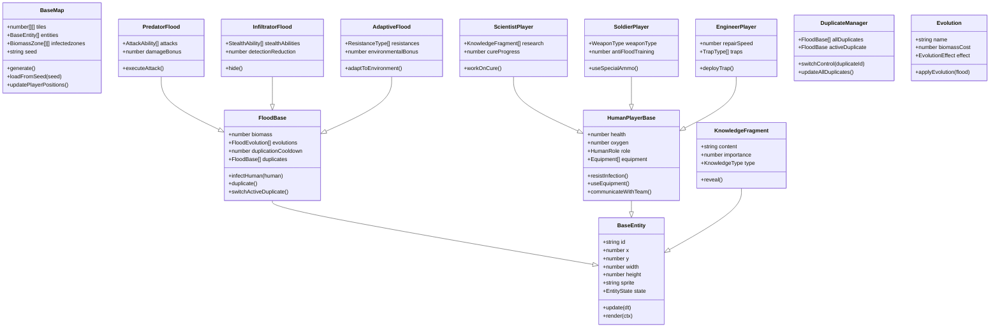

# **Cosmonavt: The Flood Edition** _Game Design Document_

### **Cosmonavt © MAAN STUDIOS Todos los derechos reservados.**
**By Mariano Carretero, Isabela Valls, Hans Preinfalk**

## _Index_

1. [Game Design](#game-design)
    1. [Summary](#summary)
        1. [Story](#story)
    2. [Gameplay](#gameplay)
    3. [Mindset](#mindset)
2. [Technical](#technical)
    1. [Screens](#screens)
    2. [Controls](#controls)
    3. [Mechanics](#mechanics)
3. [Level Design](#level-design)
    1. [Themes](#themes)
    2. [Game Flow](#game-flow)
4. [Development](#development)
    1. [Abstract Classes](#abstract-classes--components)
    2. [Derived Classes](#derived-classes--component-compositions)
5. [Graphics](#graphics)
    1. [Style Attributes](#style-attributes)
    2. [Graphics Needed](#graphics-needed)
6. [Sounds / Music](#sounds--music)
    1. [Style Attributes](#style-attributes-1)
    2. [Sounds Needed](#sounds-needed)
    3. [Music Needed](#music-needed)
7. [Schedule](#schedule)

## _Game Design_

---

### **Summary**

Cosmonavt: The Flood Edition es un roguelite sci-fi de acción con perspectiva top down. Como un ser Flood inteligente, tu objetivo es encontrar la cura antes que los humanos para destruirla, mientras exploras estaciones espaciales abandonadas, naves y planetas. Absorbe el conocimiento de los humanos que eliminas para expandir tus capacidades y descubrir pistas sobre la ubicación de la cura. Los humanos son controlados por otros jugadores, creando un desafío dinámico e impredecible en cada partida.

#### Story

Una entidad alienígena (el Flood) evolucionó en el vacío del espacio tras ser expuesta a la radiación de un agujero negro. Esta forma de vida encontró la manera de infiltrarse en una estación espacial humana, iniciando una infestación que se propagó rápidamente.

Como un Flood primario, has absorbido el conocimiento de un científico de alto rango y has desarrollado inteligencia superior y autoconciencia. A diferencia de otros Flood, comprendes que los humanos supervivientes están trabajando en una cura que podría erradicar a toda tu especie. Tu misión es clara: encontrar la cura antes que ellos y destruirla.

Los fragmentos de información sobre la cura están dispersos entre diferentes científicos y ubicaciones. Cada humano que asimilas te proporciona parte de sus conocimientos, acercándote a tu objetivo. Sin embargo, a diferencia de humanos controlados por IA, estos supervivientes (controlados por otros jugadores) son impredecibles, adaptables y trabajan en equipo para frustrar tus planes.

### **Gameplay**

Como el Flood, exploras entornos mientras buscas humanos para absorber su conocimiento y duplicarte. Cada humano eliminado te proporciona biomasa para evolucionar y, si es un científico o personal importante, información vital sobre la cura. El mundo se genera proceduralmente, creando una experiencia única en cada partida.

El objetivo principal es encontrar todos los fragmentos de información necesarios para localizar la cura antes que los humanos (jugadores reales) la desarrollen. Debes gestionar tu biomasa para evolucionar capacidades que te permitan acceder a nuevas áreas y enfrentar las tácticas de los jugadores humanos, que se adaptan a tus movimientos y coordinan estrategias defensivas.

La mecánica de duplicación es fundamental: al eliminar a un humano, puedes crear un duplicado que controlas alternando entre ambos (con la tecla Tab). Esto te permite explorar más territorio o atacar desde múltiples flancos, creando situaciones de ventaja numérica contra los humanos.

Al enfrentarte a jugadores reales en lugar de IA, cada partida presenta desafíos únicos que requieren adaptación constante y uso estratégico de tus evoluciones y duplicados.

### **Mindset**

Buscamos generar una experiencia de caza estratégica donde el jugador Flood debe adaptarse constantemente a las tácticas impredecibles de los jugadores humanos. La sensación debe ser de poder creciente con cada infección exitosa, pero con el desafío adicional de enfrentarse a oponentes inteligentes que aprenden y se adaptan.

Queremos que el jugador Flood desarrolle estrategias de emboscada, infiltración y asalto directo, decidiendo qué evoluciones priorizar según las tácticas humanas observadas. La experiencia debe alternar entre el sigilo calculado y los momentos de poder desatado cuando decides atacar abiertamente.

El jugador experimentará la satisfacción de absorber conocimiento y replicarse, sintiendo cómo cada éxito lo acerca más a su objetivo mientras fortalece sus capacidades. La presencia de oponentes humanos añade un nivel de desafío e impredecibilidad que ninguna IA podría igualar, haciendo que cada victoria se sienta verdaderamente merecida.

## _Technical_

---

### **Screens**

- Menú Principal
    - Opciones
        - Volumen general, música, efectos
        - Idioma
        - Controles
    - Crear partida
        - Elegir tipo de Flood inicial
        - Dificultad (balance de recursos)
        - Pública/Privada
            - Copiar Código de invitación
            - Enviar Código de invitación
        - Semilla de mundo personalizada
    - Unirse a partida
        - Partidas públicas
        - Partidas privadas (código)
- Juego
    - HUD
        - Biomasa acumulada
        - Cooldown de duplicación
        - Estado de evoluciones activas
        - Fragmentos de conocimiento encontrados
        - Cooldown de habilidades especiales
        - Indicador de duplicados activos
    - Árbol de Evoluciones
        - Evoluciones disponibles según biomasa
        - Tres ramas principales: Depredador, Infiltrador, Adaptativo
        - Descripción de habilidades y costos
    - Conocimiento Absorbido
        - Fragmentos de información sobre la cura
        - Pistas de ubicación para próximos objetivos
        - Datos científicos relevantes
    - Menú de pausa
        - Salir / guardar / reiniciar
        - Revisar objetivos actuales
        - Opciones multijugador
    - Pantalla de Duplicados
        - Vista general de todos tus duplicados activos
        - Estado y ubicación de cada uno
        - Opción para cambiar rápidamente entre ellos
- Pantalla de Resultados
    - Muestra fragmentos descubiertos vs. total
    - Estadísticas de humanos asimilados
    - Evoluciones desbloqueadas
    - Resultado (victoria si encontraste la cura, derrota si los humanos la desarrollaron)

### **Controls**

- Movimiento: WASD / Arrow keys
- Infectar/Asimilar: E
- Atacar: click izquierdo
- Duplicarse: Q (con cooldown)
- Alternar entre duplicados: Tab
- Activar evoluciones: 1-5
- Árbol de Evoluciones: R
- Comunicación con otros Flood: C
- Vista de detección especial: V (según evoluciones)

### **Mechanics**

#### Absorción y Duplicación

**Sistema de infección**  
El Flood puede infectar humanos mediante ataques cuerpo a cuerpo o a distancia (según evoluciones). Al eliminar a un humano, obtienes biomasa y la oportunidad de duplicarte, creando una segunda unidad Flood controlada por ti.

**Duplicación con cooldown**  
Tras eliminar a un humano, puedes duplicarte con un cooldown (60-90 segundos). Tu duplicado es una unidad separada que controlas alternando entre ambas con la tecla Tab. Esto permite explorar más territorio o enfrentar situaciones desde diferentes flancos, creando ventaja numérica contra los humanos.

**Absorción de conocimiento**  
Al infectar humanos controlados por jugadores, especialmente científicos, obtienes fragmentos de información sobre la cura. La calidad y cantidad de información varía según el rol del jugador humano, siendo los científicos los más valiosos para tu objetivo.

**Biomasa como recurso principal**  
La biomasa obtenida de humanos y recursos orgánicos es la moneda para desbloquear evoluciones. Las evoluciones avanzadas requieren más biomasa, forzando decisiones estratégicas sobre qué capacidades priorizar según las tácticas observadas en los jugadores humanos.

#### Evolución y Especialización

**Sistema de evolución trifurcado**  
La biomasa permite desbloquear nuevas mutaciones y habilidades. Se organizan en tres ramas principales:
- **Depredador**: Mejoras ofensivas (garras, tentáculos, ataque a distancia) para combate directo contra humanos bien armados.
- **Infiltrador**: Mejoras de sigilo (mimetismo, velocidad, detección) para infiltrarse en grupos humanos y atacar objetivos prioritarios.
- **Adaptativo**: Resistencia a entornos hostiles (radiación, vacío, trampas) y capacidad para sobrevivir en zonas que los humanos han asegurado.

**Mutaciones temporales**  
Algunos entornos permiten adaptaciones específicas (resistencia a radiación, camuflaje térmico). Estas mutaciones son temporales pero pueden volverse permanentes gastando biomasa extra.

**Evoluciones visuales**  
A medida que evoluciones, tu apariencia Flood cambia gradualmente, reflejando tus elecciones en el árbol de evolución. Esto tiene implicaciones tácticas, ya que los jugadores humanos pueden reconocer visualmente tus capacidades y adaptar sus estrategias.

#### Sentidos mejorados y contrarrestar humanos

**Percepción Flood**  
El Flood tiene visión de 180 grados (superior a los humanos) y puede desarrollar capacidades para detectar calor corporal a través de paredes delgadas o sentir vibraciones de movimiento. Estas habilidades son cruciales para rastrear a jugadores humanos que intentan esconderse o emboscarte.

**Rastreo de conocimiento**  
Al absorber suficiente información, desarrollas la capacidad de "sentir" dónde podrían estar ubicados los siguientes fragmentos de conocimiento, ayudándote a orientar tu exploración y potencialmente interceptar a humanos que se dirigen hacia los mismos objetivos.

**Adaptación a tácticas humanas**  
A medida que los jugadores humanos desarrollan estrategias (como usar fuego contra ti o establecer trampas), puedes evolucionar contramedidas específicas. Por ejemplo, resistencia al fuego, detección de trampas, o inmunidad a ciertos tipos de armamento.

#### Notas técnicas

- **Frontend:** El juego corre exclusivamente sobre canvas utilizando TypeScript vanilla.
- **Backend:** Express.js y PostgreSQL. El servidor maneja la generación de semillas, el guardado de progreso, evoluciones persistentes y sincronización para multijugador.
- **Multijugador:** Comunicación a través de WebSockets, permitiendo interacción en tiempo real entre Floods y humanos con latencia mínima para mantener la experiencia fluida.

## _Level Design_

### **Themes**

#### 1. Estación Espacial Contaminada

**Ambiente:**  
Pasillos metálicos parcialmente recubiertos de biomasa orgánica, luces fallando, áreas selladas por crecimiento Flood.

**Narrativa:**  
Tu primera zona de expansión. Los jugadores humanos intentan mantener áreas limpias mediante sistemas de cuarentena que debes desactivar o rodear.

**Jugabilidad:**
- Perfecto para aprender mecánicas básicas de infección y sigilo.
- Múltiples rutas de ventilación para flanquear posiciones defendidas por humanos.
- Científicos (jugadores) con primeros fragmentos clave sobre la cura.
- Defensas establecidas por jugadores humanos que requieren planificación para superar.

#### 2. Nave de Evacuación

**Ambiente:**  
Espacios confinados, sistemas de descontaminación activos, humanos armados y en constante movimiento.

**Narrativa:**  
Humanos intentando escapar con información crítica. Tu objetivo es interceptarlos y absorber sus conocimientos antes de que puedan transmitirlos a otros jugadores.

**Jugabilidad:**
- Entorno dinámico con sistemas de purga que los humanos pueden activar contra ti.
- Rutas de escape que los jugadores intentarán usar estratégicamente.
- Necesidad de coordinación entre duplicados para bloquear salidas.
- Objetivo de sabotaje: impedir que la nave sea reparada y pueda despegar.

#### 3. Colonia Minera

**Ambiente:**  
Túneles oscuros, maquinaria pesada, radiación que afecta tanto a humanos como al Flood.

**Narrativa:**  
Un bastión humano fortificado donde los jugadores realizan pruebas para componentes de la cura. La radiación natural presenta tanto desafíos como oportunidades evolutivas.

**Jugabilidad:**
- Evoluciones específicas para resistir radiación que los humanos aprovechan como defensa.
- Grandes espacios abiertos donde los humanos tienen ventaja visual alternados con túneles estrechos donde el Flood puede emboscar.
- Recursos valiosos que ambos bandos necesitan, creando puntos de confrontación inevitables.
- Zonas que los jugadores humanos pueden sellar o inundar con radiación como defensa táctica.

#### 4. Laboratorio Central

**Ambiente:**  
Instalación high-tech, sistemas de contención biológica, iluminación brillante que dificulta el sigilo, defensas avanzadas establecidas por jugadores.

**Narrativa:**  
El centro de investigación donde los humanos desarrollan la cura. Tu objetivo final es encontrar el prototipo y destruirlo antes de que los jugadores humanos lo completen.

**Jugabilidad:**
- Zona de máxima seguridad con trampas y defensas colocadas estratégicamente por jugadores humanos.
- Científicos jugadores protegidos por escoltas de soldados jugadores.
- Necesidad de usar todos tus duplicados y evoluciones coordinadamente.
- Confrontación final que requiere destruir componentes específicos mientras los humanos intentan protegerlos.

### **Game Flow**

1. **Despertar como Flood inteligente**  
   Emerges con conciencia tras absorber a un científico, descubriendo tu misión de encontrar la cura antes que los jugadores humanos.

2. **Tutorial de absorción básica**  
   Aprendes a moverte, atacar y absorber humanos, descubriendo la mecánica de duplicación.

3. **Primer enfrentamiento con jugadores humanos**  
   Descubres que estos humanos son más inteligentes y coordinados que simples NPCs, requiriendo adaptación de tus tácticas.

4. **Primer fragmento de conocimiento**  
   Al eliminar a un científico controlado por un jugador, obtienes el primer fragmento de información sobre la cura.

5. **Expansión inicial**  
   Comienzas a explorar la estación espacial, acumulando biomasa y evolucionando capacidades básicas mientras evitas grupos organizados de humanos.

6. **Descubrir nuevas áreas**  
   Los fragmentos de conocimiento revelan la ubicación de nuevas zonas donde buscar más información, pero los jugadores humanos también se dirigen allí.

7. **Dominar la duplicación**  
   Aprendes a alternar eficientemente entre tus duplicados para flanquear defensas humanas o explorar múltiples rutas simultáneamente.

8. **Especialización evolutiva**  
   Decides qué ramas de evolución priorizar según las tácticas observadas en los jugadores humanos (ataque, sigilo, adaptación).

9. **Carrera por los componentes**  
   Tanto tú como los jugadores humanos compiten por encontrar componentes físicos de la cura, creando encuentros inevitables.

10. **Confrontación con especialistas humanos**  
    Jugadores con roles específicos (soldados equipados con armas anti-Flood, ingenieros con trampas) presentan desafíos únicos.

11. **Evoluciones avanzadas**  
    Desbloqueas formas Flood especiales con habilidades diseñadas para contrarrestar tácticas humanas comunes.

12. **Sabotaje estratégico**  
    Interrumpes los esfuerzos de los jugadores humanos dañando equipamiento, contaminando suministros o bloqueando rutas clave.

13. **Descubrimiento del laboratorio central**  
    Localizas el centro donde los jugadores científicos están completando la cura.

14. **Asalto coordinado final**  
    Utilizas todos tus duplicados y evoluciones para infiltrarte en el laboratorio central, enfrentando la resistencia organizada de los jugadores humanos.

15. **Confrontación final**  
    Te enfrentas a los últimos defensores humanos protegiendo el prototipo de la cura, en un encuentro que decidirá el resultado de la partida.

16. **Victoria o derrota**  
    Si destruyes la cura, garantizas la supervivencia de los Flood. Si los jugadores humanos logran completarla y defenderla, tu especie está condenada.

## _Development_

El sistema de clases en *Cosmonavt: The Flood Edition* mantiene la arquitectura orientada a componentes del diseño original, pero enfocada en la interacción entre Flood y humanos controlados por jugadores. La clase abstracta `EntidadBase` sigue representando cualquier objeto interactivo, con `FloodBase` y `JugadorHumanoBase` como principales derivados que definen los comportamientos fundamentales de cada facción.

`FloodBase` introduce sistemas de infección, duplicación y evolución, mientras que `JugadorHumanoBase` ahora contiene lógica específica para humanos controlados por jugadores, incluyendo roles (científico, soldado, ingeniero) y métodos para la interacción y comunicación entre jugadores humanos. Las especialidades Flood como `FloodInfiltrador`, `FloodDepredador` y `FloodAdaptativo` extienden la base con habilidades y evoluciones únicas para cada rama de desarrollo.

El mapa sigue usando la clase `MapaBase`, pero ahora incluye zonas de biomasa, puntos de contaminación y sistemas de purificación que pueden ser manipulados tanto por el Flood como por los humanos. El sistema de conocimiento se implementa a través de la clase `FragmentoConocimiento`, que contiene información sobre la cura y pistas para nuevos objetivos.

Las mecánicas de duplicación y gestión de múltiples unidades se implementan a través de componentes específicos que manejan la transición entre unidades controladas y el estado global de todos los duplicados activos.

### **Abstract Classes / Components**

**Enum classes (Visualization)**

```mermaid
classDiagram
    class EntityState {
        <<enum>>
        Active
        Inactive
        Dead
    }

    class FloodEvolution {
        <<enum>>
        EnhancedSenses
        SporeProduction
        TentacleExtension
        Camouflage
        RadiationResistance
    }

    class HumanRole {
        <<enum>>
        Scientist
        Soldier
        Engineer
    }

    class BiomassZone {
        <<enum>>
        Clean
        Contaminated
        PurifiedZone
    }

    class EvolutionBranch {
        <<enum>>
        Predator
        Infiltrator
        Adaptive
    }

    class Equipment {
        <<enum>>
        Flamethrower
        PurifierGrenade
        BioScanner
        IsolationSuit
    }

    class AttackAbility {
        <<enum>>
        Slash
        Impale
        AcidSpit
        LongRange
        AreaDamage
    }

    class StealthAbility {
        <<enum>>
        Camouflage
        WallCling
        VentilationTravel
        HumanMimicry
        SilentMovement
    }

    class KnowledgeType {
        <<enum>>
        CureComponent
        Location
        AccessCode
        ResearchNotes
        ProtocolDocument
    }

    class WeaponType {
        <<enum>>
        Flamethrower
        PulseRifle
        CryoGun
        SonicEmitter
    }

    class ResistanceType {
        <<enum>>
        Radiation
        Vacuum
        Thermal
        Chemical
        Electrical
    }

    class TrapType {
        <<enum>>
        PurificationField
        MotionSensor
        Barricade
        FloodRepellent
    }
```

## _Graphics_

### **Style Attributes**

#### Estilo Visual General

*Cosmonavt: The Flood Edition* mantiene el **pixel art de resolución media**, pero ahora enfatiza la naturaleza orgánica y cambiante del Flood. Las unidades Flood son asimétricas, con animaciones fluidas que transmiten su naturaleza alienígena. El enfoque visual sigue siendo **semi-realista dentro de los límites del pixel art**, pero con mayor énfasis en transformaciones biomecánicas y efectos de corrupción ambiental.

#### Paleta de Colores

- **Tonos dominantes para el Flood:** verdes tóxicos, rojos orgánicos, púrpuras viscosos.
- **Biomasa:** texturas pulsantes con variaciones sutiles de color que indican vitalidad.
- **Contraste con humanos:** los humanos controlados por jugadores usan colores más metálicos y limpios, con variaciones según su rol (científicos, soldados, ingenieros).

#### Interfaces

- **HUD biomórfico:** indicadores que parecen venas o tejido vivo, pulsando con tu biomasa.
- **Árbol evolutivo:** interfaz de evoluciones representada como sinapsis neuronales y ramificaciones orgánicas.
- **Visión del Flood:** filtro especial que resalta el calor humano y tecnología a través de las paredes.
- **Gestor de duplicados:** interfaz orgánica que muestra tus diferentes unidades y su estado.

#### Feedback Visual

- **Infección exitosa:** partículas orgánicas, transformación gradual del sprite humano.
- **Duplicación:** animación de separación celular con efectos de estiramiento y división.
- **Evolución:** metamorfosis visible en el sprite del Flood, con nuevos apéndices o características emergiendo.
- **Detección de humanos:** pulsos visuales que indican la presencia de jugadores humanos cercanos.

### **Graphics Needed (Pixel Art)**

#### Personajes

- **Flood:** múltiples variantes según evolución, con sprites para movimiento, ataque, infección, duplicación.
- **Humanos controlados por jugadores:** científicos, soldados, ingenieros, cada uno con animaciones de movimiento, ataque, defensa y muerte.
- **Evoluciones visibles:** apéndices adicionales, cambios de color, efectos de partículas que se añaden al sprite base.

#### Entornos

- **Biomasa:** tiles que muestran diferentes niveles de contaminación Flood.
- **Sistemas de purificación:** dispositivos que los jugadores humanos pueden activar contra ti.
- **Zonas de investigación:** laboratorios y equipos científicos donde los humanos desarrollan la cura.
- **Trampas y defensas:** varios tipos de obstáculos que los jugadores humanos pueden desplegar.

#### HUD

- Indicadores orgánicos: biomasa (como vena pulsante), cooldown de duplicación (membrana regenerándose).
- Fragmentos de conocimiento: representados como neuronas conectadas o datos visualizados biológicamente.
- Árbol de evoluciones: diagrama neural que muestra progresión y opciones disponibles.
- Gestor de duplicados: interfaz que muestra todos tus duplicados activos y su estado.

#### Objetos

- Evoluciones: representaciones visuales de cada mutación disponible.
- Fragmentos de conocimiento: dispositivos de datos, notas o muestras que contienen información.
- Equipamiento humano anti-Flood: armas, trampas y herramientas que los jugadores humanos utilizan contra ti.
- Componentes de la cura: objetos físicos que ambos bandos buscan para completar sus objetivos.

## _Sounds / Music_

### **Style Attributes**

#### Música

- Música **orgánica y perturbadora**, con elementos húmedos y pulsantes.
- Combinación de **texturas biomecánicas** con **disonancias crecientes** que reflejan la expansión del Flood.
- Transiciones musicales que se intensifican con proximidad a jugadores humanos o durante confrontaciones.

#### Sonido

- Efectos orgánicos: viscosos, chirriantes, pulsantes.
- Contraste entre sonidos biológicos del Flood y tecnológicos de los humanos.
- Procesamiento de audio que simula la percepción alienígena del mundo.
- Indicadores sonoros específicos para detectar actividad humana cercana.

### **Sounds Needed**

#### Acciones del Flood

- Movimiento: sonidos húmedos, arrastre orgánico
- Infección: burbujeante, transformación dolorosa
- Duplicación: desgarro húmedo, nacimiento viscoso
- Evolución: metamorfosis orgánica, crujidos de huesos
- Ataques especializados: ácido, tentáculos, esporas
- Cambio entre duplicados: sonido de transferencia neural

#### Humanos y Entorno

- Acciones de jugadores humanos: pasos, comunicaciones por radio, manipulación de equipos
- Equipamiento anti-Flood: fuego, criocongelación, purificación
- Sistemas de alerta: alarmas, cierres de emergencia
- Hallazgos de conocimiento: sonido de revelación, pulso neural
- Trampas activándose: sonidos distintivos según el tipo

### **Music Needed**

| Situación              | Estilo musical sugerido                                     |
|------------------------|-------------------------------------------------------------|
| Sigilosa/Infiltración  | Pulsos lentos, tensión creciente, notas graves prolongadas  |
| Caza activa            | Ritmos orgánicos acelerados, capas sónicas superpuestas     |
| Confrontación humana   | Texturas disonantes, percusión intensa, caos controlado     |
| Descubrimiento         | Revelación sonora, curiosidad alienígena, emergencia tonal  |
| Evolución              | Transiciones tonales, transformación sonora, crecimiento    |
| Victoria Flood         | Triunfo perturbador, satisfacción alienígena, conclusión    |
| Derrota Flood          | Desintegración sonora, descomposición tonal, final amargo   |

## _Schedule_

### Fase 1: Prototipo Jugable Básico (Flood)

1. Diseño de clases base (`EntidadBase`, `FloodBase`, `JugadorHumanoBase`)
2. Mecánicas de infección y duplicación básica
3. Generación de mapas procedurales
4. HUD básico + estado de biomasa y cooldowns
5. Interacción básica entre Flood y jugadores humanos

### Fase 2: Núcleo de Jugabilidad

1. Sistema de evolución por ramas
2. Mecánica de duplicación y alternancia entre unidades
3. Sistema de fragmentos de conocimiento
4. Absorción de información de diferentes tipos de jugadores humanos
5. Mecánicas de progresión hacia la cura

### Fase 3: Multijugador y Balanceo

1. Refinamiento del networking para jugador vs jugador
2. Balance entre capacidades Flood y defensas humanas
3. Sistema de evoluciones persistentes entre sesiones
4. Objetivos dinámicos basados en conocimiento absorbido
5. Condiciones de victoria/derrota relacionadas con la cura

### Fase 4: Pulido y Contenido

1. Implementación de biomas completos
2. Sistemas avanzados de defensa para jugadores humanos
3. Gráficos orgánicos y evoluciones visibles
4. Efectos de sonido viscerales y música adaptativa
5. Eventos dinámicos (purgas, evacuaciones, avances científicos)

### Fase 5: Lanzamiento

1. QA y balance entre facciones
2. Optimización de sistema de duplicación y networking
3. Tutoriales específicos para mecánicas Flood
4. Sistema de emparejamiento equilibrado entre equipos
5. Publicación y seguimiento post-lanzamiento con actualizaciones de balance