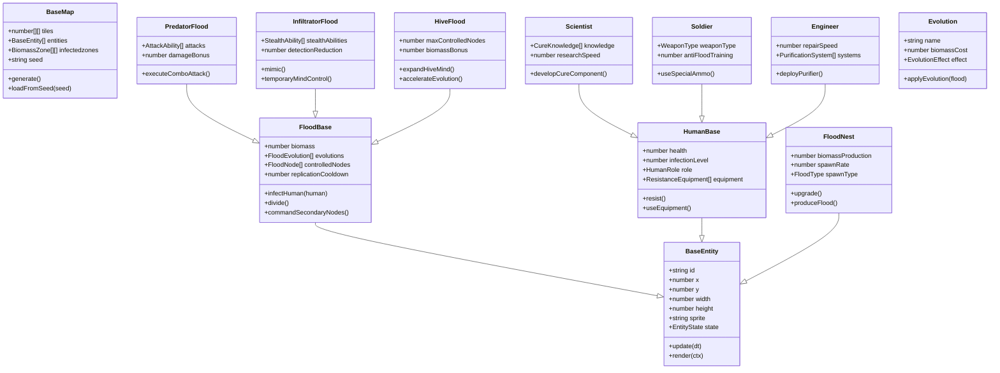

# **Cosmonavt: The Flood** _Game Design Document_

### **Cosmonavt © MAAN STUDIOS Todos los derechos reservados.**
**By Angel Montemayor Davila A01785840, Mariano Carretero Fuentes A01029708**

## _Index_

1. [Game Design](#game-design)
    1. [Summary](#summary)
        1. [Story](#story)
    2. [Gameplay](#gameplay)
    3. [Mindset](#mindset)
2. [Technical](#technical)
    1. [Screens](#screens)
    2. [Controls](#controls)
    3. [Mechanics](#mechanics)
3. [Level Design](#level-design)
    1. [Themes](#themes)
    2. [Game Flow](#game-flow)
4. [Development](#development)
    1. [Abstract Classes](#abstract-classes--components)
    2. [Derived Classes](#derived-classes--component-compositions)
5. [Graphics](#graphics)
    1. [Style Attributes](#style-attributes)
    2. [Graphics Needed](#graphics-needed)
6. [Sounds / Music](#sounds--music)
    1. [Style Attributes](#style-attributes-1)
    2. [Sounds Needed](#sounds-needed)
    3. [Music Needed](#music-needed)
7. [Schedule](#schedule)

## _Game Design_

---

### **Summary**

Cosmonavt es un roguelite sci-fi de acción con perspectiva top down. Como el Flood, expande tu influencia por estaciones espaciales abandonadas, naves y planetas. Infecta a los supervivientes humanos, construye tu colmena y evita que descubran la cura que podría erradicar tu especie.

#### Story

Una entidad alienígena (el Flood) evolucionó en el vacío del espacio tras ser expuesta a la radiación de un agujero negro. Esta forma de vida encontró la manera de infiltrarse en una estación espacial humana, iniciando una infestación que se propagó rápidamente.

Como un nodo primario del Flood, tu conciencia despertó cuando absorbiste los conocimientos de un científico de alto rango. A diferencia de tus hermanos Flood, has desarrollado inteligencia superior y capacidad estratégica. Ahora, tu objetivo es expandir la infección, crear nuevos nodos primarios y eventualmente asimilar toda forma de vida humana en el universo conocido.

Los humanos supervivientes están dispersos, algunos buscando una cura, otros simplemente tratando de escapar. Tu misión es interceptarlos, asimilarlos, y obtener sus conocimientos para impedir la creación de la cura que podría destruir a tu especie. Cada humano asimilado fortalece tu mente colmena y te acerca a la dominación total.

### **Gameplay**

Como el Flood, infectas humanos para expandir tu ejército, absorbes conocimientos de científicos, y evolucionas nuevas habilidades. Puedes dividirte para cubrir más territorio, coordinarte con tu mente colmena, y enfrentarte a humanos equipados con tecnología anti-Flood. El mundo se genera proceduralmente y debes adaptar tus estrategias a cada entorno.

El objetivo del juego es impedir que los humanos encuentren todas las piezas para fabricar la cura. Debes destruir laboratorios, infectar científicos clave, y contaminar recursos vitales. Para lograrlo, expandirás tu red de infección, recolectarás biomasa para evolucionar, y utilizarás estrategias de sigilo e infiltración.

### **Mindset**

Buscamos generar una experiencia de poder creciente: comenzando como una entidad vulnerable pero que, con cada infección exitosa, se vuelve más poderosa y temible. El jugador debe sentir la satisfacción de expandir su influencia y controlar múltiples unidades Flood simultáneamente.

Queremos que el jugador desarrolle estrategias de infección, aprenda a priorizar objetivos (científicos vs soldados), y experimente con diferentes mutaciones y evoluciones de su colmena. La sensación de horror ahora se invierte: el jugador es la amenaza que acecha en las sombras.

El jugador experimentará el crecimiento orgánico de su colmena, tomando decisiones sobre qué capacidades desarrollar primero y cómo balancear expansión rápida con evolución especializada. Cada partida ofrece una experiencia única gracias a la generación procedural y las decisiones estratégicas.

## _Technical_

---

### **Screens**

- Menú Principal
    - Opciones
        - Volumen general, música, efectos
        - Idioma
        - Controles
    - Crear partida
        - Elegir tipo de Flood inicial
        - Dificultad (resistencia humana)
        - Pública/Privada
            - Copiar Código de invitación
            - Enviar Código de invitación
        - Semilla de mundo personalizada
    - Unirse a partida
        - Partidas públicas
        - Partidas privadas (código)
- Juego
    - HUD
        - Biomasa acumulada
        - Nodos activos (cantidad de Floods controlados)
        - Estado de evoluciones activas
        - Mapa de infección (zonas controladas)
        - Cooldown de habilidades especiales
    - Red Neural (Menú de evoluciones)
        - Árbol de evoluciones disponibles
        - Nodos de especialización (ataque, sigilo, infección)
        - Mejoras de la colmena
    - Mente Colmena (Multijugador)
        - Visión compartida con otros jugadores Flood
        - Comandos tácticos para coordinar ataques
        - Transferencia de biomasa entre nodos
    - Vista de Asimilación
        - Información obtenida de humanos asimilados
        - Fragmentos de la cura encontrados/destruidos
    - Menú de pausa
        - Salir / guardar / reiniciar
        - Revisar objetivos actuales
- Pantalla de Evolución Final
    - Muestra el porcentaje de dominación alcanzado
    - Estadísticas de infección (humanos convertidos, áreas conquistadas)
    - Desbloqueos permanentes para futuras partidas

### **Controls**

- Movimiento: WASD / Arrow keys
- Infectar/Asimilar: E
- Atacar: click izquierdo
- Dividirse: Q (con cooldown)
- Ciclar unidades Flood controladas: Tab
- Activar evoluciones: 1-5
- Vista de Red Neural: R
- Comunicación con colmena (multijugador): C

### **Mechanics**

#### Infección y Replicación

**Sistema de infección**  
El Flood puede infectar humanos mediante ataques cuerpo a cuerpo o a distancia (según evoluciones). Cada humano infectado se convierte en una nueva unidad Flood bajo tu control. La infección no es instantánea; requiere un tiempo de transformación que puede ser interrumpido.

**Replicación por asimilación**  
Al matar o infectar completamente a un humano, obtienes una nueva unidad Flood. Dependiendo del tipo de humano (científico, soldado, ingeniero), la unidad Flood resultante hereda características especiales, como mayor velocidad de movimiento, resistencia o capacidad de hackeo.

**División celular (Duplicación)**  
Con suficiente biomasa acumulada, un nodo Flood puede dividirse en dos entidades independientes con cooldown (60-90 segundos). Esta habilidad permite expandirse rápidamente pero divide los recursos y debilita temporalmente ambas unidades.

**Construcción de nidos y colonias**  
En zonas seguras, puedes establecer nidos que generan biomasa pasivamente y actúan como puntos de reaparición si mueres. Las colonias más avanzadas pueden producir unidades Flood básicas automáticamente.

#### Evolución y Especialización

**Sistema de evolución**  
La biomasa recolectada de humanos y entornos permite desbloquear nuevas mutaciones y habilidades. Estas se organizan en tres ramas principales:
- **Depredador**: Mejoras ofensivas (garras, tentáculos, ataque a distancia)
- **Infiltrador**: Mejoras de sigilo (mimetismo, control mental temporal)
- **Colmena**: Mejoras de expansión (infección más rápida, duplicación mejorada)

**Mutaciones temporales**  
Algunos entornos permiten adaptaciones específicas (resistencia a radiación, camuflaje térmico). Estas mutaciones son temporales pero pueden volverse permanentes gastando biomasa extra.

**Absorción de conocimientos**  
Al infectar científicos o personal de alto rango, obtienes fragmentos de información sobre la cura. Esto te permite sabotear sus esfuerzos más efectivamente y anticipar sus movimientos.

#### Control de Mente Colmena

**Gestión multi-unidad**  
Controlas directamente una unidad Flood principal, pero puedes dar órdenes básicas a otras unidades secundarias (patrullar, atacar, defender). A mayor evolución, mayor cantidad de unidades controlables simultáneamente.

**Visión compartida**  
Todas tus unidades Flood comparten información visual. Puedes ver lo que cualquiera de tus nodos ve, permitiendo vigilancia multidireccional y coordinación táctica.

**Sistema de sacrificio**  
Puedes sacrificar unidades Flood menores para obtener biomasa de emergencia o transferirla a unidades más importantes/evolucionadas.

#### Vista del Flood

**Sentidos mejorados**  
El Flood tiene visión de 180 grados (superior a los humanos) y puede detectar calor corporal a través de paredes delgadas. Las evoluciones avanzadas permiten detectar señales electromagnéticas de equipos humanos.

#### Notas técnicas

- **Frontend:** El juego corre exclusivamente sobre canvas utilizando TypeScript vanilla.
- **Backend:** Express.js y PostgreSQL. El servidor maneja la generación de semillas, el guardado de progreso, evoluciones persistentes y sincronización para multijugador.
- **Multijugador:** Comunicación a través de WebSockets, permitiendo coordinación entre jugadores Flood para estrategias de infección coordinadas.

## _Level Design_

### **Themes**

#### 1. Estación Espacial Contaminada

**Ambiente:**  
Pasillos metálicos parcialmente recubiertos de biomasa orgánica, luces fallando, áreas selladas por crecimiento Flood.

**Narrativa:**  
Tu primera zona de expansión. Los humanos intentan mantener áreas limpias mediante sistemas de cuarentena que debes desactivar.

**Jugabilidad:**
- Perfecto para aprender mecánicas básicas de infección y sigilo.
- Múltiples rutas de ventilación para moverse entre zonas restringidas.
- Laboratorios con información valiosa sobre la cura.
- Defensas automatizadas que detectan presencia Flood.

#### 2. Nave de Evacuación

**Ambiente:**  
Espacios confinados, sistemas de descontaminación activos, humanos armados y aterrorizados.

**Narrativa:**  
Humanos intentando escapar con información crítica. Tu objetivo es impedir su huida y asimilar su conocimiento.

**Jugabilidad:**
- Entorno dinámico con sistemas de purga que dañan al Flood.
- Alta concentración de humanos para infectar rápidamente.
- Necesidad de infiltración sigilosa inicial antes de dominar completamente.
- Objetivo final: tomar el control de la nave para expandir la infección a nuevos destinos.

#### 3. Colonia Minera

**Ambiente:**  
Túneles oscuros, maquinaria pesada, radiación que afecta tanto a humanos como al Flood.

**Narrativa:**  
Un bastión humano fortificado con recursos que necesitan para la cura. La radiación natural presenta tanto desafíos como oportunidades evolutivas.

**Jugabilidad:**
- Evoluciones específicas para resistir radiación y aprovecharla.
- Grandes espacios abiertos alternados con túneles estrechos.
- Oportunidad para establecer nidos principales en zonas profundas.
- Defensas humanas pesadas que requieren estrategia para superar.

#### 4. Laboratorio Central

**Ambiente:**  
Instalación high-tech, sistemas de contención biológica, iluminación brillante que dificulta el sigilo.

**Narrativa:**  
El centro de investigación donde los humanos desarrollan la cura. Tu objetivo final es destruirlo o contaminarlo.

**Jugabilidad:**
- Zona de máxima seguridad con sensores y defensas avanzadas.
- Objetivos estratégicos específicos (contaminar muestras, destruir equipos).
- Necesidad de coordinar múltiples unidades Flood simultáneamente.
- Jefe final: científico con equipo anti-Flood experimental.

### **Game Flow**

1. **Despertar como Flood primario**  
   Emerges de los restos de un científico infectado, con conciencia y capacidad estratégica recién adquiridas.

2. **Tutorial de infección básica**  
   Aprendes a moverte, atacar e infectar humanos desprevenidos. Los primeros objetivos son sencillos.

3. **Establecimiento del primer nido**  
   Encuentras un área segura para crear tu primer nido, generando biomasa pasiva y punto de reaparición.

4. **Expansión inicial**  
   Comienzas a infectar sistemáticamente la estación espacial, ganando más unidades Flood bajo tu control.

5. **Primer contacto con resistencia organizada**  
   Enfrentas humanos con armas y equipos especializados contra el Flood. Necesitas adaptarte y evolucionar.

6. **Desbloqueo de división celular**  
   Obtienes suficiente biomasa para dividirte, controlando múltiples unidades simultáneamente y expandiéndote más rápido.

7. **Especialización evolutiva**  
   Decides qué ramas de evolución priorizar según tu estilo de juego (ataque, sigilo, expansión).

8. **Descubrimiento de información sobre la cura**  
   Al infectar científicos clave, descubres detalles sobre la cura que están desarrollando, lo que te permite sabotear sus esfuerzos.

9. **Expansión a nuevas zonas**  
   Accedes a naves de evacuación, colonias mineras y otros entornos, adaptando tus estrategias según el ambiente.

10. **Confrontación con cazadores especializados**  
    Humanos entrenados específicamente para eliminar al Flood presentan un desafío mayor, requiriendo tácticas avanzadas.

11. **Construcción de una colonia avanzada**  
    Estableces una base principal con capacidad de producir unidades Flood automáticamente, aumentando tu presencia exponencialmente.

12. **Evoluciones avanzadas**  
    Desbloqueas formas Flood especiales con habilidades únicas (control mental, explosión biológica, esporas aéreas).

13. **Infiltración en comunicaciones humanas**  
    Accedes a sus sistemas de comunicación, obteniendo información privilegiada sobre movimientos y planes futuros.

14. **Corrupción de recursos críticos**  
    Contaminas suministros, saboteas equipos y destruyes componentes necesarios para la cura.

15. **Asalto coordinado final**  
    Utilizas todas tus unidades Flood y evoluciones para atacar el laboratorio central donde se desarrolla la cura.

16. **Asimilación final**  
    Infectas al científico jefe, absorbiendo todo su conocimiento y asegurando la supervivencia del Flood.

17. **Expansión galáctica**  
    Epilogo que muestra cómo tu infección se propaga a otros planetas y sistemas, estableciendo la dominación del Flood.

## _Development_

El sistema de clases en *Cosmonavt: The Flood* mantiene la arquitectura orientada a componentes del diseño original, pero con inversión de roles. La clase abstracta `EntidadBase` sigue representando cualquier objeto interactivo, con `FloodBase` y `HumanoBase` como principales derivados que definen los comportamientos fundamentales de cada facción.

`FloodBase` introduce sistemas de infección, evolución y control de colmena, mientras que `HumanoBase` ahora contiene lógica de resistencia, equipamiento anti-Flood y roles específicos (científico, soldado, ingeniero). Las especialidades Flood como `FloodInfiltrador`, `FloodDepredador` y `FloodColmena` extienden la base con habilidades y evoluciones únicas para cada rama de desarrollo.

El mapa sigue usando la clase `MapaBase`, pero ahora incluye zonas de biomasa, puntos de contaminación y sistemas de purificación que afectan directamente al gameplay del Flood. Los nidos y colonias se implementan como extensiones de `EstructuraBase`, permitiendo la generación pasiva de recursos y unidades.

Las mecánicas de división celular, asimilación y evolución se gestionan a través de componentes modulares que pueden combinarse para crear diferentes tipos de Flood, manteniendo el código limpio y extensible.

### **Abstract Classes / Components**

**Enum classes (Visualization)**

```mermaid
classDiagram
    class EntityState {
        <<enum>>
        Active
        Inactive
        Dead
    }

    class FloodEvolution {
        <<enum>>
        EnhancedSenses
        SporeProduction
        RapidDivision
        ArmoredCarapace
        TentacleExtension
    }

    class HumanRole {
        <<enum>>
        Scientist
        Soldier
        Engineer
        Civilian
        Captain
    }

    class BiomassZone {
        <<enum>>
        Clean
        Contaminated
        InfectionNest
        PurifiedZone
    }

    class EvolutionBranch {
        <<enum>>
        Predator
        Infiltrator
        Hive
    }

    class ResistanceEquipment {
        <<enum>>
        Flamethrower
        PurifierGrenade
        BioScanner
        IsolationSuit
    }

    class AttackAbility {
        <<enum>>
        Slash
        Impale
        AcidSpit
        ExplosiveSac
        InfectionSpray
    }

    class StealthAbility {
        <<enum>>
        Camouflage
        WallCling
        VentilationTravel
        HumanMimicry
        ElectronicDisruption
    }

    class CureKnowledge {
        <<enum>>
        Formula
        Ingredient
        ProtocolDocument
        TestResults
        EquipmentSpec
    }

    class WeaponType {
        <<enum>>
        Flamethrower
        PulseRifle
        CryoGun
        SonicEmitter
    }

    class FloodType {
        <<enum>>
        Basic
        Evolved
        Specialized
        Prime
    }
```

## _Graphics_

### **Style Attributes**

#### Estilo Visual General

*Cosmonavt: The Flood* mantiene el **pixel art de resolución media**, pero ahora enfatiza la naturaleza orgánica y cambiante del Flood. Las unidades Flood son asimétricas, con animaciones fluidas que transmiten su naturaleza alienígena. El enfoque visual sigue siendo **semi-realista dentro de los límites del pixel art**, pero con mayor énfasis en transformaciones biomecánicas y efectos de corrupción ambiental.

#### Paleta de Colores

- **Tonos dominantes para el Flood:** verdes tóxicos, rojos orgánicos, púrpuras viscosos.
- **Biomasa:** texturas pulsantes con variaciones sutiles de color que indican vitalidad.
- **Contraste con humanos:** los humanos usan colores más metálicos y limpios, destacando como elementos extraños en un mundo cada vez más orgánico.

#### Interfaces

- **HUD biomórfico:** indicadores que parecen venas o tejido vivo, pulsando con tu biomasa.
- **Red Neural:** interfaz de evoluciones representada como sinapsis neuronales y ramificaciones orgánicas.
- **Visión del Flood:** filtro especial que resalta el calor humano y tecnología a través de las paredes.

#### Feedback Visual

- **Infección exitosa:** partículas orgánicas, transformación gradual del sprite humano.
- **División celular:** animación de separación celular con efectos de estiramiento y división.
- **Evolución:** metamorfosis visible en el sprite del Flood, con nuevos apéndices o características emergiendo.

### **Graphics Needed (Pixel Art)**

#### Personajes

- **Flood:** múltiples variantes según evolución, con sprites para movimiento, ataque, infección, división.
- **Humanos:** científicos, soldados, ingenieros, civiles, cada uno con animaciones de resistencia y eventual transformación.
- **Evoluciones visibles:** apéndices adicionales, cambios de color, efectos de partículas que se añaden al sprite base.

#### Entornos

- **Biomasa:** tiles que muestran diferentes niveles de contaminación Flood.
- **Nidos y colonias:** estructuras orgánicas de diferentes tamaños y complejidad.
- **Sistemas de purificación:** dispositivos humanos que emiten luz azul dañina para el Flood.

#### HUD

- Indicadores orgánicos: biomasa (como vena pulsante), nodos controlados (sinapsis), cooldowns (membranas).
- Mapa de infección: representación abstracta de zonas contaminadas vs. limpias.
- Interfaz de Red Neural: árbol de evoluciones con animaciones orgánicas.

#### Objetos

- Evoluciones: representaciones visuales de cada mutación disponible.
- Recursos especiales: contenedores de biomasa pura, muestras de la cura para destruir.
- Equipamiento humano anti-Flood: lanzallamas, granadas purificadoras, escáneres.

## _Sounds / Music_

### **Style Attributes**

#### Música

- Música **orgánica y perturbadora**, con elementos húmedos y pulsantes.
- Combinación de **texturas biomecánicas** con **disonancias crecientes** que reflejan la expansión del Flood.
- Transiciones musicales que se intensifican con tu nivel de evolución y dominio.

#### Sonido

- Efectos orgánicos: viscosos, chirriantes, pulsantes.
- Contraste entre sonidos biológicos del Flood y tecnológicos de los humanos.
- Procesamiento de audio que simula la percepción alienígena del mundo.

### **Sounds Needed**

#### Acciones del Flood

- Movimiento: sonidos húmedos, arrastre orgánico
- Infección: burbujeante, transformación dolorosa
- División: desgarro húmedo, nacimiento viscoso
- Evolución: metamorfosis orgánica, crujidos de huesos
- Ataques especializados: ácido, tentáculos, esporas

#### Humanos y Entorno

- Pánico humano: gritos, respiración agitada
- Equipamiento anti-Flood: fuego, criocongelación, purificación
- Sistemas de alerta: alarmas, cierres de emergencia
- Ambientación de nidos: pulsaciones, susurros telepáticos

### **Music Needed**

| Situación              | Estilo musical sugerido                                     |
|------------------------|-------------------------------------------------------------|
| Sigilosa/Infiltración  | Pulsos lentos, tensión creciente, notas graves prolongadas  |
| Expansión/Dominio      | Ritmos orgánicos acelerados, capas sónicas superpuestas     |
| Confrontación humana   | Texturas disonantes, percusión intensa, caos controlado     |
| Victoria/Asimilación   | Crescendo visceral, satisfacción siniestra, tema triunfal   |
| Mutación/Evolución     | Transiciones tonales, transformación sonora, emergencia     |

## _Schedule_

### Fase 1: Prototipo Jugable Básico (Flood)

1. Diseño de clases base (`EntidadBase`, `FloodBase`, `HumanoBase`)
2. Mecánicas de infección y control básico
3. Generación de mapas con zonas infectables
4. HUD básico + estados del Flood (biomasa, nodos)
5. IA humana básica (resistencia, huida, combate)

### Fase 2: Núcleo de Jugabilidad

1. Sistema de evolución y especialización
2. Mecánicas de división y control multi-unidad
3. Establecimiento de nidos y generación pasiva
4. Infección y transformación de diferentes tipos de humanos
5. Sistema de absorción de conocimientos

### Fase 3: Multijugador y Progresión

1. Networking (Mente colmena compartida)
2. Coordinación entre jugadores Flood
3. Sistema de evoluciones permanentes
4. Objetivos dinámicos basados en movimientos humanos
5. Sabotaje de la cura y contaminación estratégica

### Fase 4: Pulido y Contenido

1. Implementación de biomas completos y su afectación al Flood
2. Sistemas avanzados de resistencia humana
3. Gráficos orgánicos y evoluciones visibles
4. Efectos de sonido viscerales y música adaptativa
5. Eventos dinámicos (purgas, cacerías, evacuaciones)

### Fase 5: Lanzamiento

1. QA y balance de facciones
2. Optimización de control multi-unidad
3. Tutoriales específicos para mecánicas Flood
4. Sistema de logros y desbloqueos permanentes
5. Publicación y seguimiento post-lanzamiento
