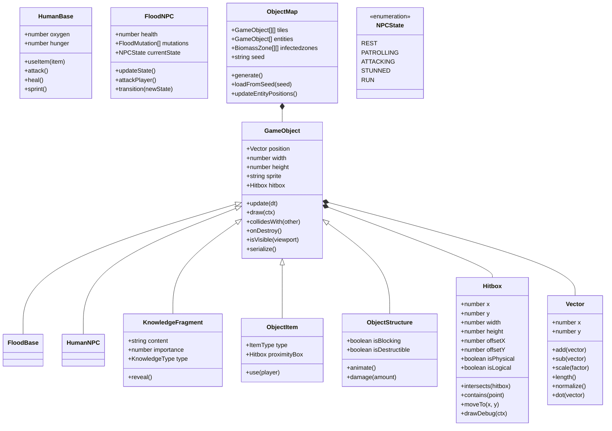

# **Cosmonavt** _Game Design Document_

### **Cosmonavt © MAAN STUDIOS Todos los derechos reservados.**
**By Angel Montemayor Davila, Katia Albigail Alvarez Contreras, Emiliano Delgadillo Osorio**

## _Index_

1. [Game Design](#game-design)
    1. [Summary](#summary)
        1. [Story](#story)
    2. [Gameplay](#gameplay)
    3. [Mindset](#mindset)
2. [Technical](#technical)
    1. [Screens](#screens)
    2. [Controls](#controls)
    3. [Mechanics](#mechanics)
3. [Level Design](#level-design)
    1. [Themes](#themes)
    2. [Game Flow](#game-flow)
4. [Development](#development)
    1. [Abstract Classes](#abstract-classes--components)
    2. [Derived Classes](#derived-classes--component-compositions)
5. [Graphics](#graphics)
    1. [Style Attributes](#style-attributes)
    2. [Graphics Needed](#graphics-needed)
6. [Sounds / Music](#sounds--music)
    1. [Style Attributes](#style-attributes-1)
    2. [Sounds Needed](#sounds-needed)
    3. [Music Needed](#music-needed)
7. [Schedule](#schedule)
8. [User Stories](#user-stories)
9. [Requirements](#requirements)
    1. [Functional](#functional-requirements)
    2. [Non-Functional](#non-functional-requirements)
10. [Feature Requests](#feature-requests)

## _Game Design_

---

### **Summary**

Cosmonavt: The Human Edition es un roguelite de acción y supervivencia sci-fi en perspectiva top-down. El jugador controla a un astronauta humano que, tras un accidente, regresa a una estación espacial infestada por el Flood. Para sobrevivir, debe recolectar fragmentos de datos, construir una cura y restaurar la esperanza de la humanidad.

Explora estaciones abandonadas y planetas hostiles mientras recolectas recursos esenciales y enfrentas enemigos Flood. El mundo se genera proceduralmente a partir de una semilla, garantizando una experiencia única en cada partida. El juego incorpora permadeath, pero mantiene el progreso narrativo a través de los fragmentos de historia encontrados. El jugador podrá cooperar con otros supervivientes en partidas multijugador.

El objetivo central es ensamblar la cura definitiva: encontrar todos los fragmentos de historia, piezas de información y localizar el laboratorio final donde fabricarla, mientras sobrevives en un universo en ruinas.

La experiencia busca transmitir vulnerabilidad, desesperación progresiva y la urgencia de sobrevivir bajo presión. El jugador debe planear estratégicamente, adaptarse al entorno y colaborar o competir con otros sobrevivientes.

### **Story**

Una nave espacial en misión se ve atrapada en las cercanías de un agujero negro. La intensa distorsión del tiempo y el espacio la divide en dos. El protagonista sobrevive y logra escapar, pero lo que para él fueron solo minutos, para el resto del universo fueron décadas.

Al regresar a la estación espacial, la encuentra irreconocible: vacía, oscura y en ruinas. Al explorar sus pasillos desiertos, descubre señales de lucha, mensajes fragmentados y cuerpos en descomposición. En un cuarto olvidado, se topa con el Flood, una entidad mutada que apenas logra esquivar.

Con cada exploración, el protagonista reconstruye los eventos que llevaron a la caída de la humanidad: un virus desconocido que arrasó estaciones y planetas enteros. La última esperanza yace oculta en registros de datos, fragmentos de inteligencias artificiales y los restos de aquellos que dieron su vida por contener el desastre. El tiempo corre, y cada pieza descubierta acerca al jugador a la posibilidad de revertir el fin de la humanidad.

## **Technical**

### **Screens**

* **Start Menu**

    * Ajustes de controles, volumen, brillo e idioma.

* **Matchmaking**

    * Crear o unirse a una partida.

    * Configurar nombre, dificultad y visibilidad (pública o privada).

    * Enviar o copiar el código de invitación.

* **In-Game Menu**

    * Reanudar partida.

    * Guardar progreso o reiniciar.

    * Consultar estadísticas de la sesión: muertes, eliminaciones, fragmentos recolectados y distancia recorrida.

    * Visualizar logros desbloqueados.

* **Endgame**

    * Reproducir cinemática final.

    * Mostrar estadísticas finales de la partida.

### **HUD Principal**

* Oxígeno

* Salud

* Energía

* Comida y agua

* Armas activas

* Cooldowns

* Fragmentos de historia recolectados

### **Controls**

* Movimiento: WASD / Flechas

* Ataque: Click izquierdo (arma equipada)

* Sprint: Shift

* Curarse (botiquín): Q

* Interactuar: E

* Cambiar armas: R

* Chat: C

### Mechanics

### **Sistema de Combate**

Cada jugador (humano o Flood) puede portar un máximo de **2 armas activas al mismo tiempo**. El jugador puede alternar entre ellas con la tecla `R` y atacar con `click izquierdo`. Esta limitación obliga a tomar decisiones estratégicas según la situación de combate. Una de las armas puede ser una **granada**, y no se acumulan. Las granadas tienen un **cooldown de 2 segundos**, se lanzan con el mismo botón de ataque y por ahora son **infinitas** (se ampliará en versiones futuras).

**Cambio de arma:**

* Cambiar entre armas toma **1 segundo**.
* No hay animación compleja (para futuras versiones).
* El HUD muestra claramente las dos armas activas y cuál está equipada.

**Interacción entre jugadores:**

* No hay daño entre jugadores.
* No hay colisión entre jugadores ni cadáveres; solo se colisiona con enemigos activos.
* Al pasar sobre un cadáver, se reproduce una pequeña animación de pisado sin impacto físico.

**Tipos de ataque humano:**

* Pistola: 15 de daño, alcance medio, cooldown de 1s
* SMG: 7 de daño por bala, ráfagas automáticas, cooldown de 0.5s entre ráfagas
* Granada: 40 de daño en área, cooldown de 2s
* Lanzallamas: 10 DPS, quemaduras persistentes por 3s

**Tipos de ataque Flood:**

* Golpe: 10 de daño cuerpo a cuerpo
* Vómito ácido: 5 de daño + visión distorsionada por 2s
* Humo tóxico: ralentiza al humano un 30%, duración 5s
* Lanza espinas: 20 de daño a distancia, cooldown de 4s

**Efectos de ataque:**

* Las granadas empujan a enemigos ligeros
* El humo reduce movilidad
* El fuego o ácido deja efectos de estado persistente

### **Exploración y Supervivencia**

**Mapas generados por semilla:**
El mundo se genera mediante una semilla controlada por el servidor. El cliente renderiza entornos como estaciones abandonadas, naves y planetas utilizando tilemaps sobre canvas. Cada sala puede contener condiciones especiales: radiación, vacío, oscuridad, etc.

**Interacciones con el entorno:**

* **Puertas**: se abren/cierra con `E`. Las puertas selladas requieren hackeo en futuras versiones.
* **Paneles eléctricos**: activan luz con `E`, consumen energía y afectan la visibilidad del mapa.
* **Cuerpos**: saqueables con `E`. El loot depende del tipo de cadáver:

    * Humano militar: armas, munición, botiquines, fragmentos
    * Humano civil: comida, agua, linternas, logs
    * Flood básico: biomasa, restos orgánicos
    * Flood evolucionado: biomasa rara, fragmentos especiales
* **Objetos destruibles**: resaltados con grietas, color vivo o parpadeo. Los no destruibles no reaccionan.

**Gestión de recursos**

**Humanos:**

* **Oxígeno**: se reduce al moverse/correr. A 0: visión en túnel + –5 HP/s
* **Comida/agua**: recuperan +10 y +5 HP respectivamente. Beber da +10% de regeneración por 20s. No consumir reduce energía base en 10% por minuto (máx. 50%) y aplica penalizaciones:

    * Visión en túnel
    * Movimiento –25%
    * Precisión –20%

**Flood:**

* **Biomasa**: se usa para curarse (+15 HP por unidad), clonar o evolucionar. Valor por tipo:

    * Civil: 1 biomasa
    * Militar: 2 biomasa
    * Flood básico: 0.5 biomasa
    * Flood evolucionado: 1.5 biomasa

**Ambos:**

* **Energía**: usada para habilidades y paneles. Se regenera 1 cada 10s o con ítems especiales.

### **Progresión y Fragmentos de Historia**

**Fragmentos de historia:**

* Ítems persistentes con relevancia narrativa
* 3 tipos: comunes, cifrados y clave
* Aparecen en cuerpos, consolas o zonas ocultas
* Algunos requieren eventos especiales para aparecer (boss, puzzles, generadores)
* Se almacenan en el **Diario Universal** (`TAB`):

    * Leíbles, reproducibles, categorizados
    * No se duplican pero mejoran puntuación de la partida
    * Desbloquean cinemáticas, zonas, habilidades pasivas o finales
* Máximo 5 por partida. No son obligatorios para ganar

### **Clonación y Habilidades Especiales**

**Humanos:**

* **Sprint** (`Shift`): dura 4s, cooldown 8s
* **Curarse** (`Q` con botiquín): +40 HP tras canalizar 2s

**Flood:**

* **Clonación** (`Q`): requiere estar quieto, consume 1 biomasa, tarda 5s y genera clon con 50% HP. Si se interrumpe, se reinicia.
* **Evolución**: se activa al consumir 3 cadáveres humanos; sube de nivel y otorga mejoras permanentes

### **Sigilo y Detección**

**Humanos:**

* Detección enemiga:

    * Luz total: 8 tiles
    * Luz media: 5 tiles
    * Oscuridad: 3 tiles
* Sonido que alerta: correr, disparar, explosiones (no aplica a hackeo o clonación)

**Flood:**

* Ven mejor en la oscuridad (6 tiles sin importar luz)
* En zonas iluminadas:

    * Precisión –25%
    * Detección reducida a 3 tiles

### **Visión del Jugador**

**Humanos:**

* Campo visual limitado a 145° usando raycasting.
* Solo se renderizan enemigos y objetos dentro del cono.
* Si el jugador activa generadores, la visión puede ampliarse temporalmente hasta 365°.

**Flood:**

* Visión periférica adaptada a la oscuridad, con campo visual extendido de forma natural en zonas sin luz (hasta 365°).
* En zonas muy iluminadas, el campo de visión se reduce hasta 90° y los bordes se tornan borrosos.
* El cono de visión Flood ignora elementos ambientales menores, pero se ve afectado por estructuras grandes y obstáculos sólidos.

### **Estadísticas y Leaderboard**

Al final de la partida, se presenta un resumen y ranking:

* Fragmentos encontrados
* Tiempo de supervivencia
* Enemigos eliminados (por tipo)
* Distancia recorrida
* Tamaño del ejército Flood
* Total de muertes del jugador

## **Level Design**

### **Themes**

1. **Estación Espacial Abandonada**

2. **Nave Infectada**

3. **Planeta Árido**

4. **Mundo Selvático Alienígena**

### **Game Flow**

1. Cinemática Inicial

2. Despertar

3. Exploración Inicial

4. Primer Encuentro con el Flood

5. Obtención de Recursos

6. Acceso a la Navegación Espacial

7. Exploración Libre

8. Encuentros Multijugador

9. Mejora de Equipamiento

10. Construcción de la Cura

11. Final Dinámico

## **Development**

### **Abstract Classes / Components**

### **Derived Classes / Component Compositions**

#### **Clases de Entidades Principales**

* **PlayerHuman**
    * Controlado por el jugador.
    * Puede moverse, atacar con armas, interactuar con objetos y usar consumibles.
    * Gestiona oxígeno, energía, hambre y sed.
* **FloodMutant**
    * Enemigo controlado por IA.
    * Patrulla, detecta jugadores y ataca.
    * Puede evolucionar en variantes más peligrosas según condiciones del mapa.

#### **Clases de Objetos Interactivos**

* **ItemConsumable**
    * Representa objetos consumibles como comida, agua y botiquines.
    * Al ser usados, restauran estados vitales (salud, hambre, sed).
* **ItemWeapon**
    * Representa armas equipables.
    * Varía en tipo de ataque (corto/largo alcance) y daño.
    * Ejemplos: pistola, SMG, lanzallamas.
* **ObjectTerminal**
    * Consolas de navegación o acceso a registros.
    * Permiten activar viajes, desbloquear zonas o recolectar fragmentos de historia.
* **ObjectDoor**
    * Puertas selladas o abiertas.
    * Se pueden desbloquear mediante interacción.
* **ObjectContainer**
    * Cajas de loot dispersas por el mapa.
    * Contienen armas, consumibles o fragmentos de historia.

#### **Clases de Entorno Especiales**

* **EnvironmentalHazard** (futuro)
    * Representará trampas naturales o tecnológicas.
    * Ejemplos: zonas de radiación, minas ocultas.

### **Listado de Clases a Programar**

#### **Núcleo del Juego**

* **Game**
    * Punto de entrada principal.
    * Gestiona el ciclo de juego, actualizaciones y renderizado.
    * Métodos principales: `initialize()`, `update()`, `render()`, `changeState()`.
* **GameState**
    * Clase abstracta para representar diferentes estados del juego.
    * Subclases: `MenuState`, `PlayState`, `PauseState`, `GameOverState`.
* **AssetManager**
    * Carga y gestiona imágenes, sonidos y datos.
    * Métodos: `loadImage()`, `loadSound()`, `getImage()`, `getSound()`.
* **InputManager**
    * Captura entradas de teclado y ratón.
    * Métodos: `update()`, `isKeyDown()`, `isMouseButtonDown()`, `getMousePosition()`.

#### **Entidades del Juego**

* **PlayerHuman**
    * Controla al jugador humano.
    * Métodos: `movePlayer()`, `attack()`, `useItem()`, `manageVitals()`.
* **FloodMutant**
    * Enemigos IA.
    * Métodos: `updateState()`, `attackPlayer()`, `mutateIfNeeded()`.
* **Projectile**
    * Gestión de proyectiles (balas, lanzallamas).
    * Métodos: `update()`, `checkCollision()`, `applyEffect()`.

#### **Mapa y Entorno**

* **LevelGenerator**
    * Generación procedural de niveles basada en semilla.
    * Métodos: `generateLevel()`, `createRooms()`, `connectRooms()`.
* **TileMap**
    * Renderizado y gestión de tiles.
    * Métodos: `render()`, `getTileAt()`, `isWalkable()`.
* **Room**
    * Representación de habitaciones.
    * Métodos: `generate()`, `populateWithEntities()`, `connectTo()`.
* **EnvironmentalHazard**
    * Representa trampas ambientales.
    * Métodos: `triggerEffect()`, `render()`.

#### **UI y Menús**

* **UIManager**
    * Gestión de interfaces de usuario.
    * Métodos: `render()`, `update()`, `showDialog()`, `hideDialog()`.
* **HUD**
    * Barra de oxígeno, salud, energía, indicadores de armas y fragmentos.
    * Métodos: `renderStatusBars()`, `renderFragments()`.
* **Menu**
    * Navegación principal del juego.
    * Métodos: `render()`, `handleInput()`, `selectOption()`.
* **DialogSystem**
    * Sistema de registros de historia.
    * Métodos: `showDialog()`, `advanceDialog()`, `hideDialog()`.

#### **Sistema de Física**

* **PhysicsSystem**
    * Manejo de colisiones físicas.
    * Métodos: `update()`, `checkCollisions()`, `resolveCollision()`.

#### **Audio**

* **AudioSystem**
    * Reproducción de efectos de sonido y música.
    * Métodos: `playSound()`, `playMusic()`, `setVolume()`.

## **Graphics**

### **Style Attributes**

* **Estilo Visual General**: Pixel art de 32x32 o 64x64, enfoque en proporciones humanas estilizadas, animaciones claras y fluidas adaptadas a resoluciones bajas.

* **Paleta de Colores**: Tonos metálicos apagados (gris, azul oscuro, marrón oxidado) con acentos de alerta (rojo, verde fosforescente).

* **Interfaces**: Estilo minimalista, inspirado en "traje espacial". Pantallas flotantes pixeladas con efecto de distorsión.

* **Feedback Visual**:

    * Daño recibido: parpadeo de pantalla, sprites con tonalidad roja momentánea.

    * Interacción: contornos iluminados, efectos de "glitch".

    * Estados críticos: distorsión de pantalla para bajos niveles de oxígeno, visión borrosa si la salud baja.

## _Graphics_

### **Style Attributes**

#### Estilo Visual General

*Cosmonavt* utiliza **pixel art de resolución media**, con proporciones humanas estilizadas y animaciones limitadas pero
expresivas. El enfoque es **semi-realista dentro de los límites del pixel art**, evitando caricaturas exageradas. Se
busca transmitir decadencia, aislamiento y tensión espacial a través de composiciones limpias, paletas sobrias y
detalles atmosféricos.

#### Paleta de Colores

- **Tonos dominantes:** negros, grises metálicos, azul oscuro, marrón oxidado.
- **Acentos:** colores saturados usados con moderación (rojo de alerta, verde alienígena, cian brillante).
- **Uso del contraste:** los elementos interactivos y peligros deben destacarse claramente del fondo.

Approximation para paleta de colores: máximo ~32–48 colores por bioma para mantener claridad visual en canvas sin
más complejidades o filtros automáticos.

#### Interfaces

- **Minimalismo visual:** HUD pequeño, esquinas superiores para indicadores.
- **Estilo “traje espacial”:** interfaces cuadradas, monocolor con animaciones tipo scanlines o glitch.
- **Integración diegética:** pantallas flotantes pixeladas proyectadas por el traje o consolas.

#### Feedback Visual

- **Daño recibido:** parpadeo de la pantalla, sprites rojos, partículas de sangre digitalizadas.
- **Interacción:** sprites con contorno brillante al acercarse, animaciones de parpadeo o rotación.
- **Estados alterados:** paleta desaturada si tienes poco oxígeno, overlay rojo si estás herido, distorsión simulada con
  desplazamiento de sprites.

#### Ambientación y entornos

- Las **estaciones** deben parecer viejas, sucias, con detalles en las paredes (tuberías, pantallas rotas, graffiti,
  sangre flotante).
- Las **naves infectadas** usan patrones pixelados orgánicos, mezclando texturas de carne con metal corroído.
- Los **planetas** se diferencian por siluetas y color: tonos cálidos y áridos vs junglas alienígenas saturadas.

### **Graphics Needed (Pixel Art)**

#### **Personajes**

* **Astronauta Humano**

    * Animaciones en 4 a 8 direcciones: idle, caminar, atacar, usar objeto, recibir daño.

    * Evoluciones visuales:

        * **Ingeniero**: Traje más especializado, herramientas visibles, menor armamento.

        * **Guerrero**: Armadura parcial, armas de alto calibre, postura de combate.

        * **General (Boss)**: Traje dañado, manchas de sangre visibles, actitud intimidante.

* **Flood Mutante**

    * Variantes de enemigos en pequeño, mediano y grande.

    * Cada variante con su propio set de animaciones: caminar, atacar, mutar.

#### **Entornos**

* **Tilesets**

    * Estaciones: pisos metálicos, paneles dañados, zonas contaminadas.

    * Naves: estructuras invadidas por biomasa alienígena.

    * Planetas: terrenos áridos con cráteres o junglas densas alienígenas.

* **Objetos Decorativos**

    * Consolas rotas, paneles interactivos, puertas automáticas.

    * Cápsulas de escape y contenedores abandonados.

* **Zonas Alienígenas**

    * Biomasa viva: suelos orgánicos, muros palpitantes, nodos infectados.

#### **HUD**

* Barras verticales/compactas para oxígeno, salud y energía.

* Indicadores visuales de armas activas y tiempos de cooldown.

* Iconos pequeños de fragmentos de historia recolectados.

#### **Objetos**

* Íconos pixelados de:

    * Consumibles: paquetes de comida, botellas de agua, botiquines.

    * Armas: pistolas de plasma, rifles automáticos, lanzallamas.

    * Equipamiento: mochilas, visores de traje.

    * Fragmentos de historia: chips de memoria, discos holográficos.

## _Sounds / Music_

### **Audio**

#### Música

- Música **ambiental lo-fi o synth minimalista**, con **texturas retro-futuristas**.
- Acorde al pixel art, se puede usar un enfoque **chiptune oscuro y ambiental** en momentos clave, combinado con pads
  atmosféricos más modernos.

#### Sonido

- Los efectos deben tener un **estilo retro estilizado**, inspirados en consolas 16-bit pero con diseño moderno.
- Sonido digitalizado con compresión de calidad media para mantener estética retro.

---

### **Sounds Needed**

#### Acciones

- Pasos diferenciados por superficie (metal, arena, carne)
- Disparos: corto alcance, largo alcance, energía, plasma
- Abrir puertas, hackear (sonido de carga o interferencia)
- Alertas del traje: pitido agudo, voz distorsionada (tipo radio)
- HUD: “beeps” al cambiar entre menús

#### Enemigos

- Flood: rugidos secos, chillidos rápidos, sonidos húmedos/distorsionados
- Entornos: crujidos, zumbidos de gravedad, radiación como interferencia sonora

---

### **Music Needed**

| Escenario        | Estilo musical sugerido                                     |
|------------------|-------------------------------------------------------------|
| Tema principal   | Synth ambiental, notas lentas, arpegios en menor            |
| Nave infectada   | Pads disonantes, samples orgánicos, ritmo débil y latente   |
| Espacio abierto  | Silencio con ecos, loops ambientales con distorsión         |
| Combate          | Chiptune agresivo + percusión digital, loops tensos         |
| Créditos finales | Piano digital, sintetizador melancólico, atmósfera relajada |

## Assets Requeridos

### Ilustraciones y Ejemplos Visuales

#### Concept Art

- **Estación Espacial Abandonada**
    - Pasillos oscuros y dañados, luz mínima.
    - Detalles como graffiti de auxilio, paneles quemados, cápsulas de escape abiertas.

- **Nave Infectada**
    - Integración visual de estructuras tecnológicas invadidas por biomasa.
    - Paredes orgánicas, suelos pulsantes, puertas bloqueadas por tejido alienígena.

- **Planeta Árido** (futuras versiones)
    - Superficies rojizas o anaranjadas, tormentas de arena en el fondo.
    - Restos de maquinaria minera abandonada.

- **Mundo Selvático Alienígena** (futuras versiones)
    - Vegetación exótica, criaturas bioluminiscentes.
    - Caminos ocultos y trampas naturales entre el follaje.

#### Personajes Clave

- **Astronauta Inicial**
    - Traje limpio, modular, enfocado en supervivencia.

- **Ingeniero (Evolución)**
    - Añadido de herramientas visibles (llaves, tabletas de datos).

- **Guerrero (Evolución)**
    - Armamento visible, armadura parcial reforzada.

- **General (Boss)**
    - Traje visiblemente dañado, detalles de sangre y cicatrices.

- **Flood Mutante**
    - Variantes visuales por nivel de mutación.
    - Ejemplo: Flood larva (pequeño), Flood adulto (grande y musculoso).

#### Ejemplos Ambientales

- Cápsulas de escape abiertas en zonas de gravedad cero.
- Contenedores de suministros flotando.
- Paneles de navegación semi-funcionales proyectando hologramas defectuosos.
- Zonas donde la biomasa crece de forma descontrolada.

## Notas Técnicas y Plan de Desarrollo

### Frontend

- **Canvas API**: Motor de renderizado principal (sin frameworks).
- **JavaScript Vanilla**: Estructuración de toda la lógica de juego.
- **Vite**: Herramienta para build y servidor de desarrollo.

### Backend

- **Node.js**: Servidor de ejecución principal.
- **Express.js**: API REST para gestionar usuarios, partidas y progreso.
- **WebSockets (Socket.IO)**: Comunicación en tiempo real para multijugador.
- **PostgreSQL**: Base de datos para almacenar cuentas, progresos y registros de historia.

### Infraestructura

- **GitHub**: Repositorio principal y control de versiones.
- **Docker** (en caso de ser necesario): Para entornos de prueba consistentes en backend.

### Arquitectura del Juego

- Separación clara de capas:
    - **Motor de juego** (render, físicas, IA)
    - **Capa de red** (sincronización, matchmaking)
    - **Persistencia** (guardado de progreso, estadísticas)

### Plan de Desarrollo

1. **Fase 1: Prototipo Jugable**
    - Movimiento del jugador.
    - Sistema básico de disparo.
    - Primer mapa generado por semilla.
    - HUD mínimo: oxígeno, salud.

2. **Fase 2: Entidades y Combate**
    - Incluir Flood Mutantes.
    - IA básica de enemigos.
    - Colisiones, proyectiles.

3. **Fase 3: Progresión y Mundo Persistente**
    - Fragmentos de historia recolectables.
    - Sistema de upgrades de personaje.
    - Sistema de navegación espacial.

4. **Fase 4: Multijugador**
    - Conexión de dos jugadores.
    - Comunicación y estado compartido.

5. **Fase 5: Pulido y Lanzamiento**
    - Cinemáticas.
    - Mejoras visuales y efectos.
    - Sonido y música.
    - QA y optimización final.

## _Schedule_

### Fase 1: Prototipo Jugable Básico

1. Diseño de clases base (`EntidadBase`, `JugadorBase`, `EnemigoBase`)
2. Generación procedural de mapas (semilla, tilemap)
3. HUD básico + estados vitales (oxígeno, hambre, energía)
4. Movimiento y colisiones básicas
5. Interacciones básicas (abrir puertas, recoger recursos)

### Fase 2: Núcleo de Jugabilidad

1. Inventario + crafting funcional
2. IA básica de enemigos (Flood): patrullaje y ataque
3. Combate cuerpo a cuerpo y con armas simples
4. Sistema de muerte con persistencia narrativa
5. Personalización de traje y módulos

### Fase 3: Multijugador y Progresión

1. Networking (WebSockets, sincronización mínima)
2. Chat + partidas privadas/públicas
3. Sistema de progresión (mejoras permanentes, XP)
4. Registros narrativos y diarios
5. Sistema de reputación / alianzas / traición

### Fase 4: Pulido y Contenido

1. Implementación de biomas (estación, nave infectada, planeta árido, mundo alien)
2. Cinemáticas y finales dinámicos
3. Gráficos definitivos (pixel art, efectos)
4. Sonido y música inmersiva
5. Eventos globales dinámicos

### Fase 5: Lanzamiento

1. QA y optimización
2. Anti-cheat y seguridad multijugador
3. Escalabilidad y pruebas de servidor
4. Accesibilidad (subtítulos, daltonismo)
5. Publicación y seguimiento post-lanzamiento

